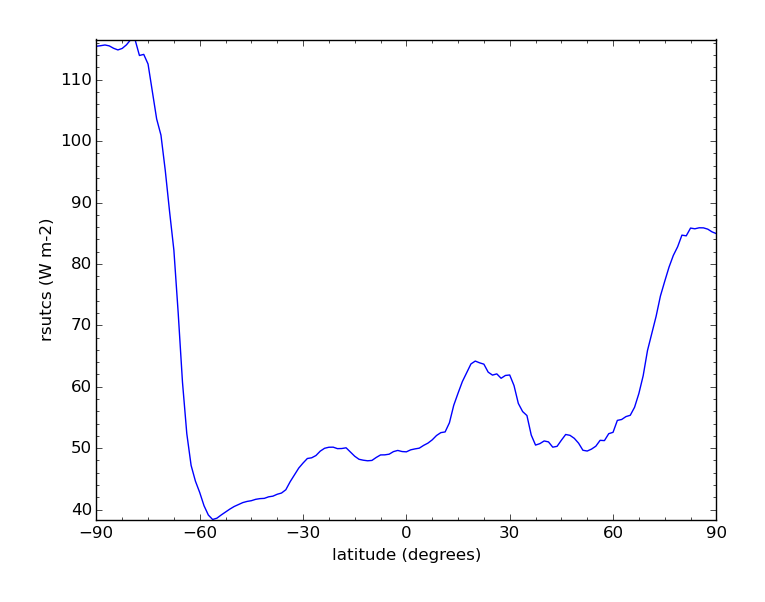

.. _aggregation:
.. |nbsp| unicode:: 0xA0

***********
Aggregation
***********

The Community Intercomparison Suite (CIS) has the ability to aggregate both gridded and ungridded data along one or
more coordinates. For example, you might aggregate a dataset over the longitude coordinate to produce an averaged
measurement of variation over latitude.

CIS supports 'complete collapse' of a coordinate - where all values in that dimension are aggregated so that the
coordinate no longer exists - and 'partial collapse' - where a coordinate is aggregated into bins of fixed size,
so that the coordinate still exists but is on a coarser grid. Partial collapse is currently only supported for ungridded
data. The output of an aggregation is always a CF compliant gridded NetCDF file.

The aggregation command has the following syntax::

  $ cis aggregate <datagroup>[:options] <grid> [-o <outputfile>]

where:

``<datagroup>``
  is a :ref:`CIS datagroup <datagroups>` specifying the variables and files to read and is of the format
  ``<variable>...:<filename>[:product=<productname>]`` where:

    * ``<variable>`` is a mandatory variable or list of variables to use.
    * ``<filenames>`` is a mandatory file or list of files to read from.
    * ``<productname>`` is an optional CIS data product to use (see :ref:`Data Products <data-products-reading>`):

  See :ref:`datagroups` for a more detailed explanation of datagroups.

``<options>``
  Optional arguments given as ``keyword=value`` in a comma separated list. Options are:

  * ``kernel=<kernel>`` - the method by which the value in each aggregation cell is determined. ``<kernel>`` should be
    one of:

    * ``mean`` - use the mean value of all the data points in that aggregation cell. For gridded data, this mean is
      weighted to take into account differing cell areas due to the projection of lat/lon lines on the Earth.
    * ``min`` - use the lowest valid value of all the data points in that aggregate cell.
    * ``max`` - use the highest valid value of all the data points in that aggregate cell.
    * ``moments`` - In addition to returning the mean value of each cell (weighted where applicable), this kernel also
      outputs the number of points used to calculate that mean and the standard deviation of those values, each as a
      separate variable in the output file.

    If not specified the default is ``moments``.

  * ``product=<productname>`` is an optional argument used to specify the type of files being read. If omitted, CIS
    will attempt to figure out which product to use based on the filename. See :ref:`data-products-reading` to see a
    list of available product names and their file signatures.

``<grid>``
  This mandatory argument specifies the coordinates to aggregate over and whether they should be completely collapsed
  or aggregated into bins. Multiple coordinates can be aggregated over, in which case they should be separated by commas.
  Coordinates may be identified using their variable names (e.g. ``latitude``), standard names, or using the axes shorthands: ``x``, ``y``, ``t``,
  ``z`` and ``p`` which refer to longitude, latitude, time, altitude and pressure respectively.

  .. note::
    The axes shorthands are used throughout the examples here, but should be used with care, as the expected coordinate
    may not always be chosen. For example when specifying 'z' for a gridded hybrid height file, this may well refer to
    model level number rather than altitude. For this reason it is often safer to use variable names explicitly.

  * *Complete collapse* - To perform a complete collapse of a coordinate, simply provide the name of the coordinate(s)
    as a comma separated list - e.g. ``x,y`` will aggregate data completely over both latitude and longitude. For
    ungridded data this will result in length one coordinates with bounds reflecting the maximum and minimum values of the
    collapsed coordinate.
  * *Partial collapse* - To aggregate a coordinate into bins, specify the start, end and step size of those bins in the
    form ``coordinate=[start,end,step]``. The step may be missed out, in which case the bin will span the whole range
    given. Partial collapse is currently only supported for ungridded data.

     Longitude coordinates are considered to be circular, so that -10 is equivalent to 350. The start and end must
     describe a monotonically increasing coordinate range, so ``x=[90,-90,10]`` is invalid, but could be specified
     using ``x=[90,270,10]``. The range between the start and end must not be greater than 360 degrees.

  Complete and partial collapses may be mixed where applicable - for example, to completely collapse time and to
  aggregate latitude on a grid from -45 degrees to 45 degrees, using a step size of 10 degrees:

  ``t,y=[-45,45,10]``

  .. note::
      For ungridded data, if a coordinate is left unspecified it is collapsed completely. This is in contrast to
      gridded data where a coordinate left unspecified is not used in the aggregation at all.

  .. note:: The range specified is the very start and end of the grid, the actual midpoints of the aggregation cells will start at ``start + delta/2``.

  **Date/times:**

  Date/times are specified in the format: ``YYYY-MM-DDThh:mm:ss`` in which ``YYYY-MM-DD`` is a date and ``hh:mm:ss`` is
  a time. A colon or space can be used instead of the 'T' separator (but if a space is used, the argument must be quoted).
  Any trailing components of the date/time may be omitted. When a date/time is used as a range start, the earliest
  date/time compatible with the supplied components is used (e.g., ``2010-04`` is treated as ``2010-04-01T00:00:00``)
  and when used as a range end, the latest compatible date/time is used. Including optional and alternative components,
  the syntax is ``YYYY[-MM[-DD[{T|:| }hh[:mm[:ss]]]]]``.

  Date/time steps are specified in the ISO 8061 format ``PnYnMnDTnHnMnS``, where any particular time period is optional,
  for example ``P1MT30M`` would specify a time interval of 1 month and 30 minutes. Years and months are treated as
  calendar years and months, meaning they are not necessarily fixed in length. For example a date interval of 1 year and
  1 month would mean going from 12:00 15th April 2013 to 12:00 15th May 2013. The are two exceptions to this, in rare
  cases such as starting at 30th January and going forward 1 month, the month is instead treated as a period of 28 days.
  Also, for the purposes of finding midpoints for the start in a month the month is always treated as 30 days. For
  example, to start on the 3rd November 2011 at 12:00 and aggregate over each month up to 3rd January 2013 at 12:00:

  * ``t=[2011-11-03T12:00,2013-01,P1M]``

  **Multi-dimensional gridded coordinates**

  Some gridded coordinates can span multiple dimensions, such as hybrid height. These coordinates can be aggregated over
  as normal, but note that if you only aggregate over a subset of the dimensions a mean kernel will always be used, and
  no area weighting will be taken into account.

``<outputfile>``
  is an optional argument to specify the name to use for the file output. This is automatically given a ``.nc`` extension if not
  present. This must not be the same file path as any of the input files. If not supplied, the default filename is ``out.nc``.

A full example would be::

  $ cis aggregate rsutcs:rsutcs_Amon_HadGEM2-A_sstClim_r1i1p1_*.nc:product=NetCDF_Gridded,kernel=mean t,y=[-90,90,20],x -o rsutcs-mean

Conditional Aggregation
=======================

Sometimes you may want to perform an aggregation over all the points that meet a certain criteria - for example,
aggregating satellite data only where the cloud cover fraction is below a certain threshold. This is possible by
performing a CIS evaluation on your data first - see :ref:`evaluation-conditional`

Aggregation Examples
====================

Ungridded aggregation
---------------------

Aircraft Track
^^^^^^^^^^^^^^

Original data::

  $ cis plot TT_A:RF04.20090114.192600_035100.PNI.nc --xmin -180 --xmax -120 --ymin 0 --ymax 90

.. figure:: img/aggregation/NCAR-RAF-1.png
   :width: 400px
   :align: center

Aggregating onto a coarse grid::

  $ cis aggregate TT_A:RF04.20090114.192600_035100.PNI.nc x=[-180,-120,3],y=[0,90,3] -o NCAR_RAF-1
  $ cis plot TT_A:NCAR_RAF-1.nc

.. figure:: img/aggregation/NCAR-RAF-2.png
   :width: 400px
   :align: center

Aggregating onto a fine grid::

  $ cis aggregate TT_A:RF04.20090114.192600_035100.PNI.nc x=[180,240,0.3],y=[0,90,0.3] -o NCAR_RAF-2
  $ cis plot TT_A:NCAR_RAF-2.nc

.. figure:: img/aggregation/NCAR-RAF-3.png
   :width: 400px
   :align: center

Aggregating with altitude and time::

  $ cis aggregate TT_A:RF04.20090114.192600_035100.PNI.nc t=[2009-01-14T19:30,2009-01-15T03:45,30M],z=[0,15000,1000] -o NCAR_RAF-3
  $ cis plot TT_A:NCAR_RAF-3.nc --xaxis time --yaxis altitude

.. figure:: img/aggregation/NCAR-RAF-4.png
   :width: 400px
   :align: center

Aggregating with altitude and pressure::

  $ cis aggregate TT_A:RF04.20090114.192600_035100.PNI.nc p=[100,1100,20],z=[0,15000,500] -o NCAR_RAF-4
  $ cis plot TT_A:NCAR_RAF-4.nc --xaxis altitude --yaxis air_pressure --logy

.. figure:: img/aggregation/NCAR-RAF-5.png
   :width: 400px
   :align: center

MODIS L3 Data
^^^^^^^^^^^^^

Original data::

  $ cis plot Cloud_Top_Temperature_Mean_Mean:MOD08_E3.A2010009.005.2010026072315.hdf

.. figure:: img/aggregation/MODIS-6.png
   :width: 400px
   :align: center

Aggregating with a mean kernel::

  $ cis aggregate Cloud_Top_Temperature_Mean_Mean:MOD08_E3.A2010009.005.2010026072315.hdf x=[-180,180,10],y=[-90,90,10] -o cloud-mean
  $ cis plot Cloud_Top_Temperature_Mean_Mean:cloud-mean.nc

.. figure:: img/aggregation/MODIS-7.png
   :width: 400px
   :align: center

Aggregating with the standard deviation kernel::

  $ cis aggregate Cloud_Top_Temperature_Mean_Mean:MOD08_E3.A2010009.005.2010026072315.hdf:kernel=stddev x=[-180,180,10],y=[-90,90,10] -o cloud-stddev
  $ cis plot Cloud_Top_Temperature_Mean_Mean:cloud-stddev.nc &

.. figure:: img/aggregation/MODIS-7.png
   :width: 400px
   :align: center

Aggregating with the maximum kernel::

  $ cis aggregate Cloud_Top_Temperature_Mean_Mean:MOD08_E3.A2010009.005.2010026072315.hdf:kernel=max x=[-180,180,10],y=[-90,90,10] -o cloud-max
  $ cis plot Cloud_Top_Temperature_Mean_Mean:cloud-max.nc

.. figure:: img/aggregation/MODIS-9.png
   :width: 400px
   :align: center

Aggregating with the minimum kernel::

  $ cis aggregate Cloud_Top_Temperature_Mean_Mean:MOD08_E3.A2010009.005.2010026072315.hdf:kernel=min x=[-180,180,10],y=[-90,90,10] -o cloud-min
  $ cis plot Cloud_Top_Temperature_Mean_Mean:cloud-min.nc

.. figure:: img/aggregation/MODIS-10.png
   :width: 400px
   :align: center

Gridded aggregation
-------------------

Aggregating 3D model data over time and longitude to produce an averaged measure of variation with latitude::

  $ cis aggregate rsutcs:rsutcs_Amon_HadGEM2-A_sstClim_r1i1p1_185912-188911.nc:kernel=mean t,x -o agg-out.nc
  $ cis plot rsutcs:agg-out.nc --xaxis latitude --yaxis rsutcs -o gridded_collapse.png

This file can be found in::

  /group_workspaces/jasmin/cis/data/CMIP5

