***********
Aggregation
***********

The Community Intercomparison Suite (CIS) has the ability to aggregate along one or more coordinates, for both gridded and ungridded data. This page describes how to perform aggregation and the options available.

To perform aggregation, run a command of the format::

  $ cis aggregate variable:filenames[:options] grid -o outputfile

where:

``variable``
  A non-optional argument used to specify the name of the variable to aggregate

``filenames`` 
  A non-optional argument used to specify the files to read the variable from. These can be specified as a comma separated list of the following possibilities:

    #. A single filename - this should be the full path to the file
    #. A single directory - all files in this directory will be read
    #. A wildcarded filename - A filename with any wildcards compatible with the python module glob, so that \*, ? and [] can all be used. E.g. /path/to/my/test*file_![0-9]. 

  Note that when using option 2, the filenames in the directory will be automatically sorted into alphabetical order. When using option 3, the filenames matching the wildcard will also be sorted into alphabetical order. The order of the comma separated list will however remain as the user specified, e.g. ``filename1,filename2,wildc*rd,/my/dir/,filename3``, would read ``filename1``, then ``filename2``, then all the files that match ``"wildc*rd"`` (in alphabetical order), then all the files in the directory ``"/my/dir/"`` (in alphabetical order) and then finally ``filename3``.

``options``
  Optional arguments given as keyword=value in a comma separated list. Options are:

  * ``kernel`` - either ``mean``, ``max``, ``min`` or ``stddev`` depending on the type of aggregation required. If not specified the default is ``mean``.
  * ``product`` - the data product to use for the plot (see :ref:`data-products-reading`).

``grid``
  The coordinates to aggregate are specified, along with a start, end and step size if not completely collapsing a dimension. For example, to completely collapse time and to aggregate latitude on a grid from -45 degrees to 45 degrees, using a step size of 10 degrees:

  * ``t,y=[-45,45,10]``

  .. note:: For ungridded data a coordinate with no grid given is always collapsed completely, if this example was used for ungridded data specifying ``t`` would have no effect.

  Date/times are specified in the format: ``YYYY-MM-DDThh:mm:ss`` in which ``YYYY-MM-DD`` is a date and ``hh:mm:ss`` is a time. A colon or space can be used instead of the 'T' separator (but if a space is used, the argument must be quoted). Any trailing components of the date/time may be omitted. When a date/time is used as a range start, the earliest date/time compatible with the supplied components is used (e.g., ``2010-04`` is treated as ``2010-04-01T00:00:00``) and when used as a range end, the latest compatible date/time is used. Including optional and alternative components, the syntax is ``YYYY[-MM[-DD[{T|:| }hh[:mm[:ss]]]]]``. When the ``t=[value]`` form is used, value is interpretted as both the start and end value, as described above, giving a range spanning the specified date/time, e.g., ``t=[2010]`` gives a range spanning the whole of the year 2010.

  Date/time steps are specified as ``$y$m$d$H$M$s``, where any particular time period is optional, for example ``1m30M`` would specify a time interval of 1 month and 30 minutes. Years and months are treated as calendar years and months, meaning they are not necessarily fixed in length. For example a date interval of 1 year and 1 month would mean going from 12:00 15th April 2013 to 12:00 15th May 2013. The are two exceptions to this, in rare cases such as starting at 30th January and going forward 1 month, the month is instead treated as a period of 28 days. Also, for the purposes of finding midpoints for the start in a month the month is always treated as 30 days. For example, to start on the 3rd November 2011 at 12:00 and aggregate over each month up to 3rd January 2013 at 12:00:

  * ``t=[2011-11-03T12:00,2013-01,1m]``

  .. note:: The range specified is the very start and end of the grid, the actual midpoints of the aggregation cells will start at ``start + delta/2``.  CIS will throw a warning and automatically reduce the range if the grid requested goes outside the range of the gridded data. The start and end of the gridded data are considered to be from the start of the bounding box of the first cell to the end of the bounding box for the last cell.

  .. warning:: When aggregating gridded data weighting for cell areas is only applied when using the ``mean`` kernel and collapsing a coordinate completely. In all other situations no weighting is applied.

``outputfile``
  is an optional argument to specify the name to use for the file output. This is automatically given a .nc extension and prepended with cis- to make it distinguishable as a colocated file. The default filename is cis-out.nc.

A full example would be::

  $ cis aggregate rsutcs:rsutcs_Amon_HadGEM2-A_sstClim_r1i1p1_185912-188911.nc:product=NetCDFGriddedByVariableName,kernel=mean t,y=[-90,90,20],x -o rsutcs-mean

Aggregation Examples
====================

Ungridded aggregation
---------------------

Aircraft Track
^^^^^^^^^^^^^^

Original data::

  $ cis plot TT_A:RF04.20090114.192600_035100.PNI.nc --xmin -180 --xmax -120 --ymin 0 --ymax 90

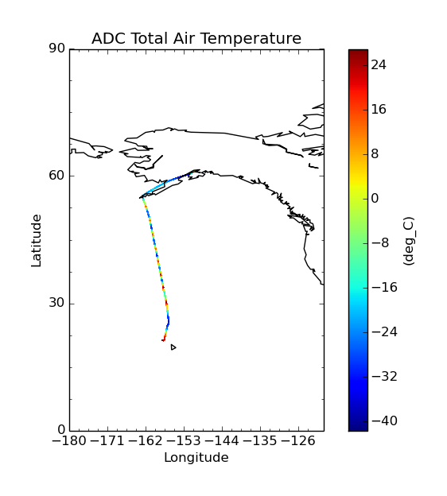

Aggregating onto a coarse grid::

  $ cis aggregate TT_A:RF04.20090114.192600_035100.PNI.nc x=[-180,-120,3],y=[0,90,3] -o NCAR_RAF-1
  $ cis plot TT_A:cis-NCAR_RAF-1.nc:product=NetCDFGriddedByVariableName

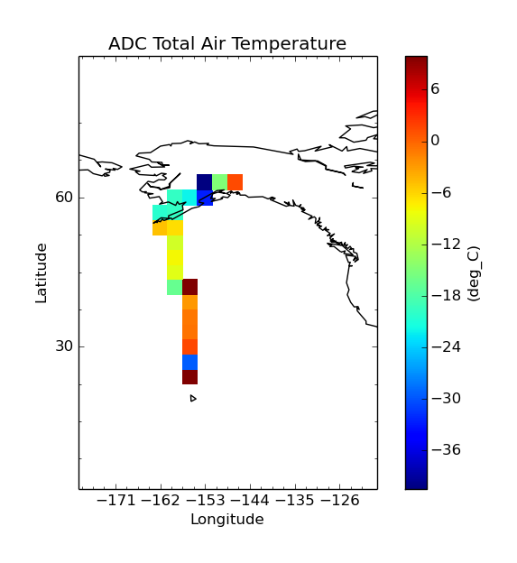

Aggregating onto a fine grid::

  $ cis aggregate TT_A:RF04.20090114.192600_035100.PNI.nc x=[180,240,0.3],y=[0,90,0.3] -o NCAR_RAF-2
  $ cis plot TT_A:cis-NCAR_RAF-2.nc:product=NetCDFGriddedByVariableName

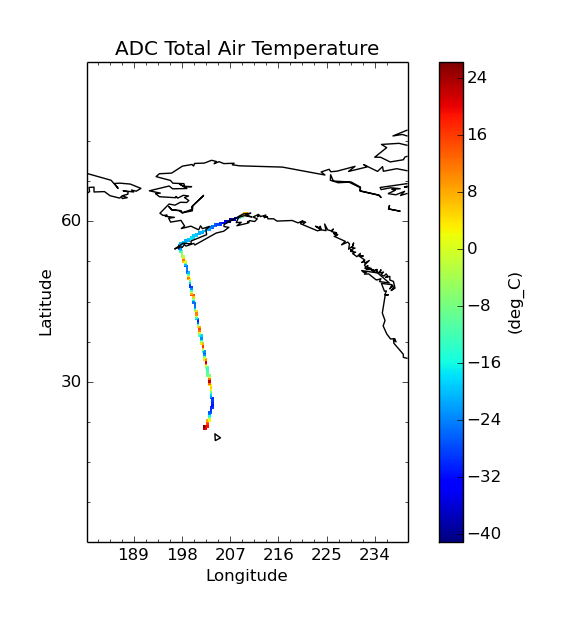

Aggregating with altitude and time::

  $ cis aggregate TT_A:RF04.20090114.192600_035100.PNI.nc t=[2009-01-14T19:30,2009-01-15T03:45,30M],z=[0,15000,1000] -o NCAR_RAF-3
  $ cis plot TT_A:cis-NCAR_RAF-3.nc:product=NetCDFGriddedByVariableName --xaxis time --yaxis altitude

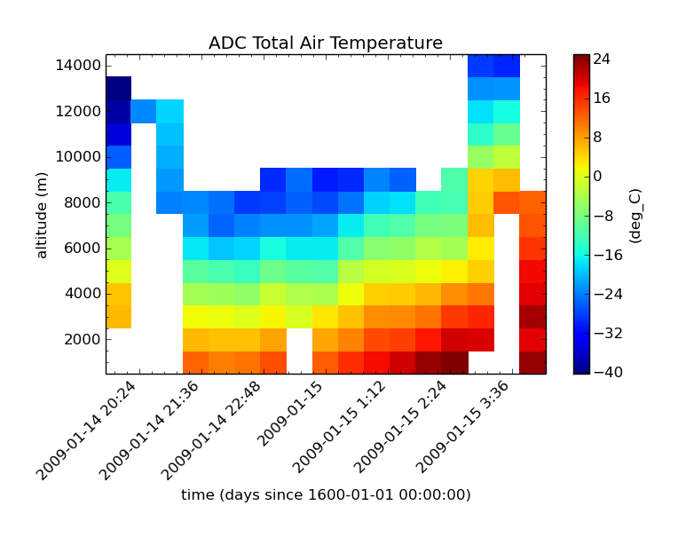

Aggregating with altitude and pressure::

  $ cis aggregate TT_A:RF04.20090114.192600_035100.PNI.nc p=[100,1100,20],z=[0,15000,500] -o NCAR_RAF-4
  $ cis plot TT_A:cis-NCAR_RAF-4.nc:product=NetCDFGriddedByVariableName --xaxis altitude --yaxis air_pressure --logy

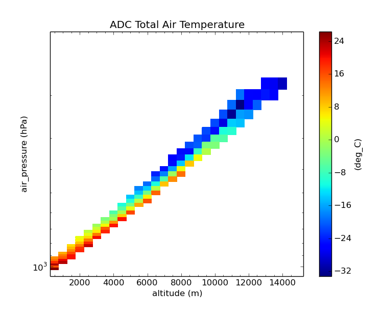

MODIS L3 Data
^^^^^^^^^^^^^

Original data::

  $ cis plot Cloud_Top_Temperature_Mean_Mean:MOD08_E3.A2010009.005.2010026072315.hdf

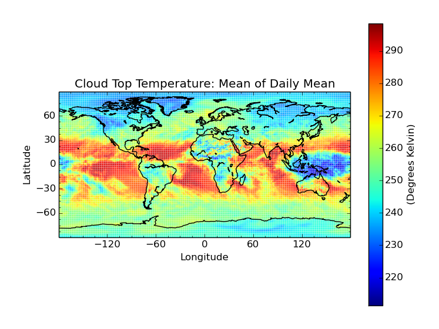

Aggregating with a mean kernel::

  $ cis aggregate Cloud_Top_Temperature_Mean_Mean:MOD08_E3.A2010009.005.2010026072315.hdf x=[-180,180,10],y=[-90,90,10] -o cloud-mean
  $ cis plot Cloud_Top_Temperature_Mean_Mean:cis-cloud-mean.nc:product=NetCDFGriddedByVariableName

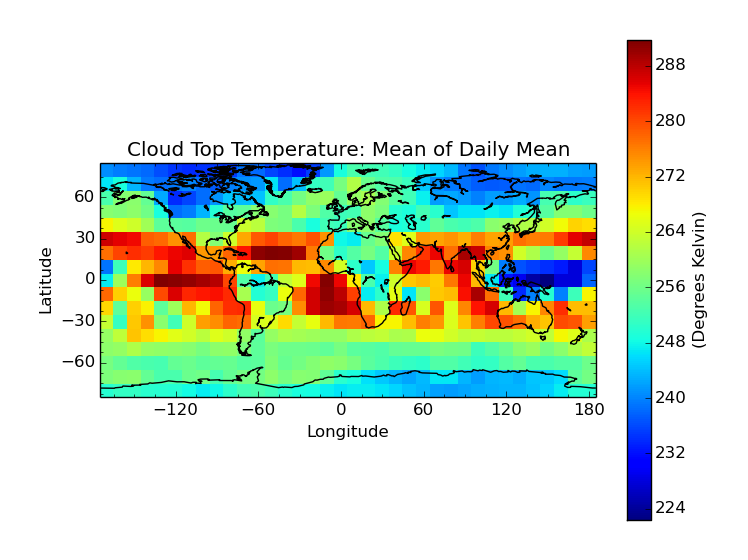

Aggregating with the standard deviation kernel::

  $ cis aggregate Cloud_Top_Temperature_Mean_Mean:MOD08_E3.A2010009.005.2010026072315.hdf:kernel=stddev x=[-180,180,10],y=[-90,90,10] -o cloud-stddev
  $ cis plot Cloud_Top_Temperature_Mean_Mean:cis-cloud-stddev.nc:product=NetCDFGriddedByVariableName &

Aggregating with the maximum kernel::

  $ cis aggregate Cloud_Top_Temperature_Mean_Mean:MOD08_E3.A2010009.005.2010026072315.hdf:kernel=max x=[-180,180,10],y=[-90,90,10] -o cloud-max
  $ cis plot Cloud_Top_Temperature_Mean_Mean:cis-cloud-max.nc:product=NetCDFGriddedByVariableName

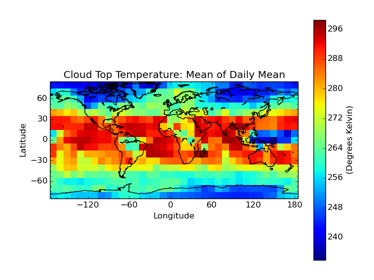

Aggregating with the minimum kernel::

  $ cis aggregate Cloud_Top_Temperature_Mean_Mean:MOD08_E3.A2010009.005.2010026072315.hdf:kernel=min x=[-180,180,10],y=[-90,90,10] -o cloud-min
  $ cis plot Cloud_Top_Temperature_Mean_Mean:cis-cloud-min.nc:product=NetCDFGriddedByVariableName

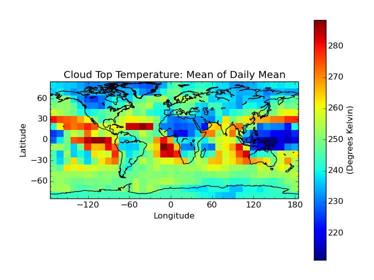

Gridded aggregation
-------------------

Aggregating onto a coarser grid::

  $ cis aggregate rsutcs:rsutcs_Amon_HadGEM2-A_sstClim_r1i1p1_185912-188911.nc:product=NetCDFGriddedByVariableName,kernel=mean t,y=[-90,90,20],x=[-0.9375,359.0625,20]
  $ cis plot rsutcs:cis-out.nc:product=NetCDFGriddedByVariableName,itemstyle=s --type scatter --itemwidth 400 --ymin -90 --ymax 90

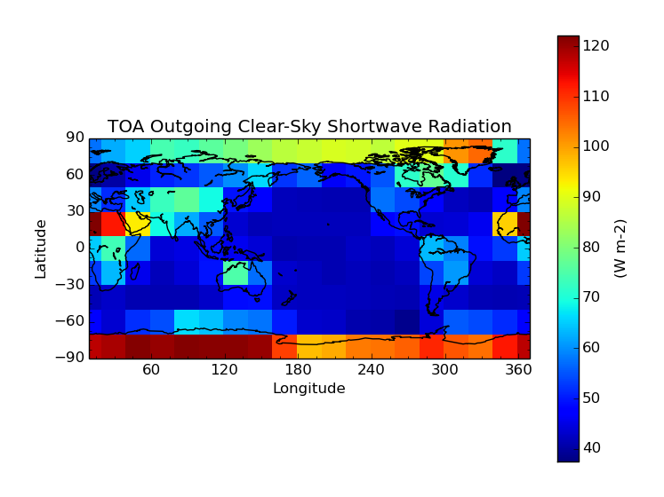

Aggregating a subset of latitude, ignoring longitude::

  $ cis aggregate rsutcs:rsutcs_Amon_HadGEM2-A_sstClim_r1i1p1_185912-188911.nc:product=NetCDFGriddedByVariableName,kernel=mean t,y=[-45,45,15]
  $ cis plot rsutcs:cis-out.nc:product=NetCDFGriddedByVariableName,itemstyle=s --ymin -45 --ymax 45 --type scatter --itemwidth 300

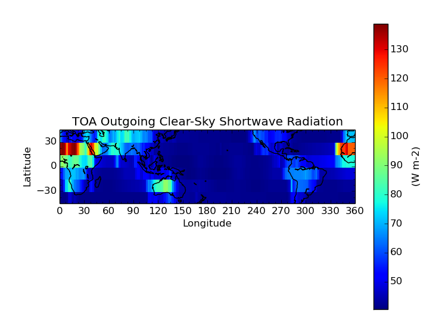

Aggregating in time - years::

  $ cis aggregate rsutcs:rsutcs_Amon_HadGEM2-A_sstClim_r1i1p1_185912-188911.nc:product=NetCDFGriddedByVariableName,kernel=mean t=[1859-11-27,1869-11-27,1y],y=[-90,90,20],x
  $ cis plot rsutcs:cis-out.nc:product=NetCDFGriddedByVariableName,itemstyle=s --xaxis time --yaxis latitude --type scatter --itemwidth 400 --ymin -90 --ymax 90

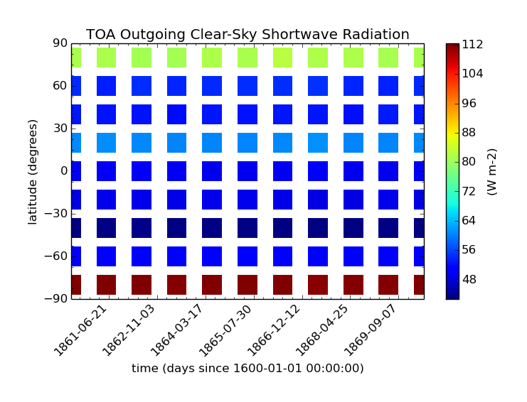

Aggregating in time - months, days and hours::

  $ cis aggregate tas:tas_day_HadGEM2-ES_rcp45_r1i1p1_20051201-20151130.nc:product=NetCDFGriddedByVariableName,kernel=mean t=[2003,2015,1m1d1H],x
  $ cis plot tas:cis-out.nc:product=NetCDFGriddedByVariableName,itemstyle=s --xaxis time --yaxis latitude --type scatter --itemwidth 10 

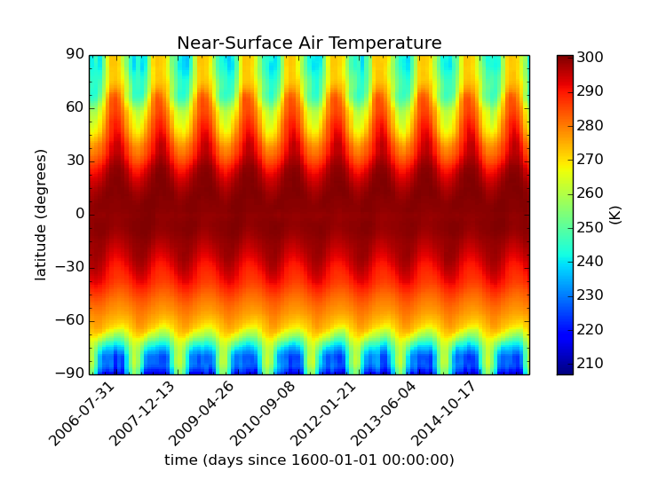

Maximum kernel::

  $ cis aggregate tas:tas_day_HadGEM2-ES_rcp45_r1i1p1_20051201-20151130.nc:product=NetCDFGriddedByVariableName,kernel=max t
  $ cis plot tas:cis-out.nc:product=NetCDFGriddedByVariableName,itemstyle=s

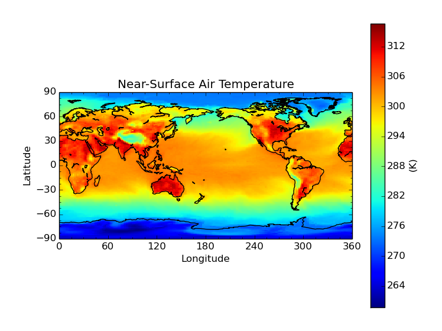

Standard deviation kernel::

  $ cis aggregate tas:tas_day_HadGEM2-ES_rcp45_r1i1p1_20051201-20151130.nc:product=NetCDFGriddedByVariableName,kernel=stddev t
  $ cis plot tas:cis-out.nc:product=NetCDFGriddedByVariableName,itemstyle=s

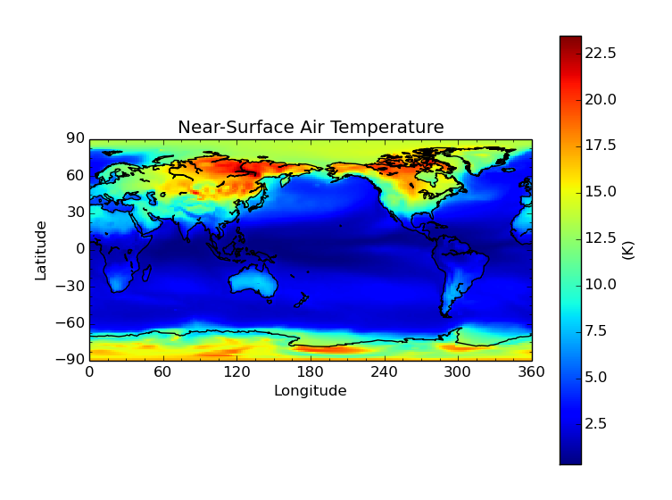

File Locations
--------------

The files used above can be found at::

  /group_workspaces/jasmin/cis/gridded-test-data/cmip5.output1.MOHC.HadGEM2-ES.rcp45.day.atmos.day.r1i1p1.v20111128
    tas_day_HadGEM2-ES_rcp45_r1i1p1_20051201-20151130.nc
  /group_workspaces/jasmin/cis/data/CMIP5
    rsutcs_Amon_HadGEM2-A_sstClim_r1i1p1_185912-188911.nc

