====================
Collocation Examples
====================

Ungridded to Ungridded Collocation Examples
===========================================

Ungridded data with vertical component
--------------------------------------

First subset two Caliop data files::

  $ cis subset Temperature:CAL_LID_L2_05kmAPro-Prov-V3-01.2009-12-31T23-36-08ZN.hdf x=[170,180],y=[60,80],z=[28000,29000],p=[13,15] -o 2009
  $ cis subset Temperature:CAL_LID_L2_05kmAPro-Prov-V3-01.2010-01-01T00-22-28ZD.hdf x=[170,180],y=[60,80],z=[28000,29000],p=[12,13.62] -o 2010

Results of subset can be plotted with::

  $ cis plot Temperature:cis-2009.nc --itemwidth 25 --xaxis time --yaxis air_pressure
  $ cis plot Temperature:cis-2010.nc --itemwidth 25 --xaxis time --yaxis air_pressure

Then collocate data, and plot output::

  $ cis col Temperature:cis-2010.nc cis-2009.nc:collocator=box[p_sep=1.1],kernel=nn_p
  $ cis plot Temperature:cis-out.nc --itemwidth 25 --xaxis time --yaxis air_pressure

The output for the two subset data files, and the collocated data should look like:

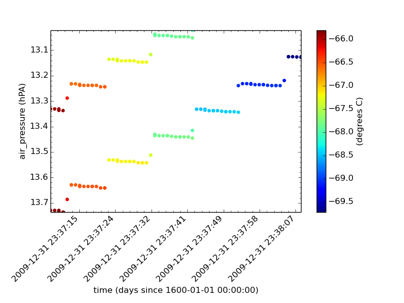

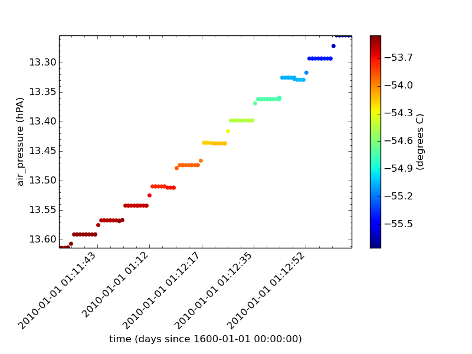

.. image:: img/PressureCollocation.png
   :width: 300px

File Locations
^^^^^^^^^^^^^^

The files used above can be found at::

  /group_workspaces/jasmin/cis/data/caliop/CAL-LID-L2-05km-APro

Ungridded data collocation using k-D tree indexing
--------------------------------------------------

These examples show the syntax for using the k-D tree optimisation of the separation constraint. The indexing is only by horizontal position.

Nearest-Neighbour Kernel
^^^^^^^^^^^^^^^^^^^^^^^^

The first example is of Aerosol CCI data on to the points of a MODIS L3 file (which is an ungridded data file but with points lying on a grid).

Subset to a relevant region::

  $ cis subset AOD550:20080612093821-ESACCI-L2P_AEROSOL-ALL-AATSR_ENVISAT-ORAC_32855-fv02.02.nc x=[-6,0],y=[20,30] -o AOD550n_3
  $ cis subset Cloud_Top_Temperature_Mean_Mean:MOD08_E3.A2010009.005.2010026072315.hdf x=[-6,0],y=[20,30] -o MOD08n_3

The results of subsetting can be plotted with::

  $ cis plot AOD550:cis-AOD550n_3.nc --itemwidth 10
  $ cis plot Cloud_Top_Temperature_Mean_Mean:cis-MOD08n_3.nc --itemwidth 20

These should look like:

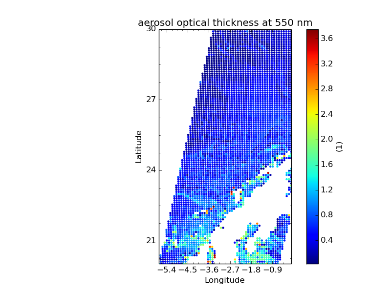

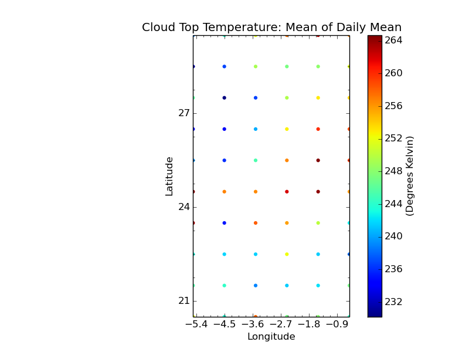

To collocate with the nearest-neighbour kernel use::

  $ cis col Cloud_Top_Temperature_Mean_Mean:cis-MOD08n_3.nc cis-AOD550n_3.nc:collocator=box[h_sep=150],kernel=nn_h -o MOD08_on_AOD550_nn_kdt

This can be plotted with::

  $ cis plot Cloud_Top_Temperature_Mean_Mean:cis-MOD08_on_AOD550_nn_kdt.nc --itemwidth 10

The sample points are more closely spaced than the data points, hence a patchwork effect is produced.

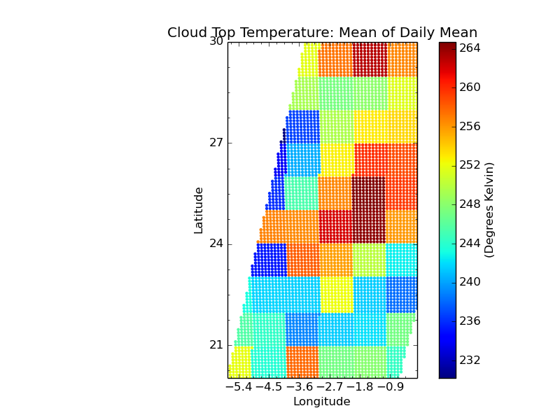

Collocating the full Aerosol CCI file on to the MODIS L3 with::

  $ cis col AOD550:20080612093821-ESACCI-L2P_AEROSOL-ALL-AATSR_ENVISAT-ORAC_32855-fv02.02.nc MOD08_E3.A2010009.005.2010026072315.hdf:variable=Cloud_Top_Temperature_Mean_Mean,collocator=box[h_sep=150],kernel=nn_h -o AOD550_on_MOD08_kdt_nn_full

gives the following result

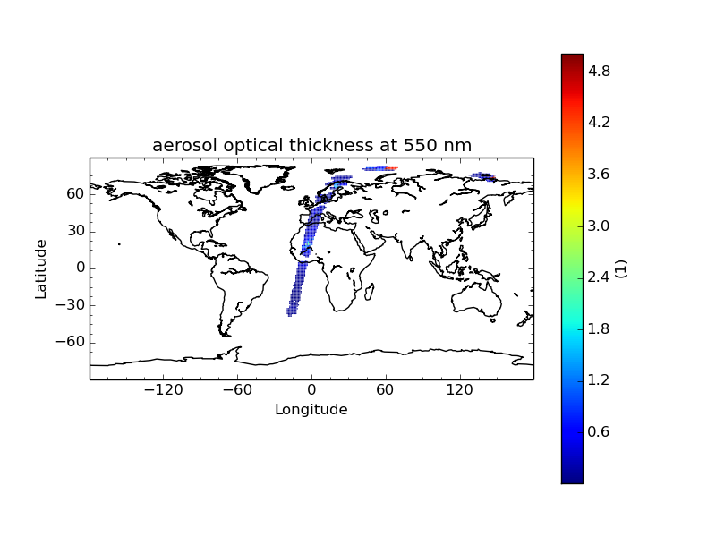

Mean Kernel
^^^^^^^^^^^
This example is similar to the first nearest-neighbour collocation above::

  $ cis col Cloud_Top_Temperature_Mean_Mean:cis-MOD08n_3.nc cis-AOD550n_3.nc:collocator=box[h_sep=75],kernel=mean -o MOD08_on_AOD550_hsep_75km

Plotting this again gives a granular result::

  $ cis plot Cloud_Top_Temperature_Mean_Mean:cis-MOD08_on_AOD550_hsep_75km.nc --itemwidth 10

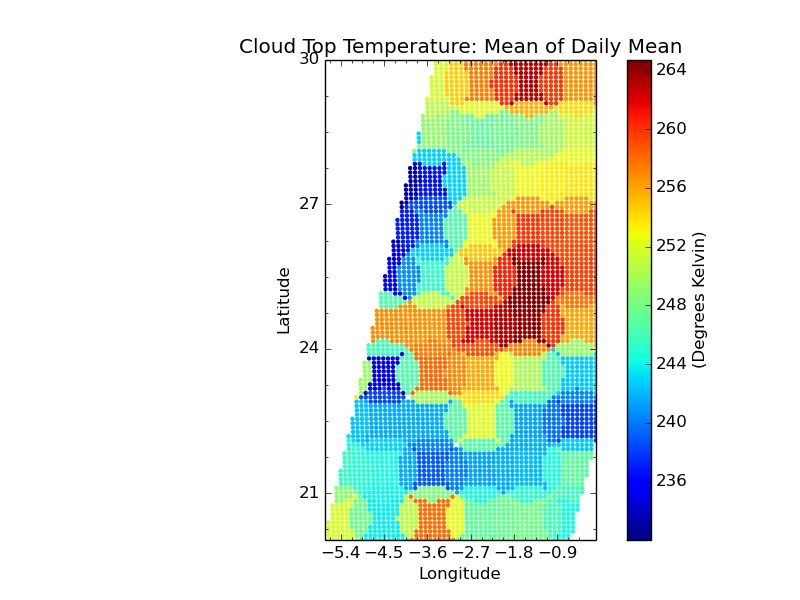

This example collocates the Aerosol CCI data on to the MODIS L3 grid::

  $ cis col AOD550:20080612093821-ESACCI-L2P_AEROSOL-ALL-AATSR_ENVISAT-ORAC_32855-fv02.02.nc MOD08_E3.A2010009.005.2010026072315.hdf:variable=Cloud_Top_Temperature_Mean_Mean,collocator=box[h_sep=50,fill_value=-999],kernel=mean -o AOD550_on_MOD08_kdt_hsep_50km_full

This can be plotted as follows, with the full image and zoomed into a representative section show below::

  $ cis plot AOD550:cis-AOD550_on_MOD08_kdt_hsep_50km_full.nc --itemwidth 50

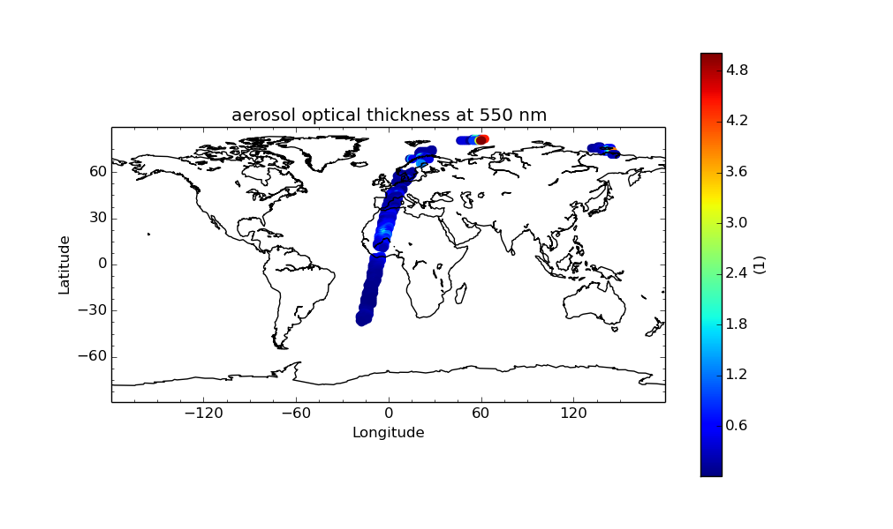

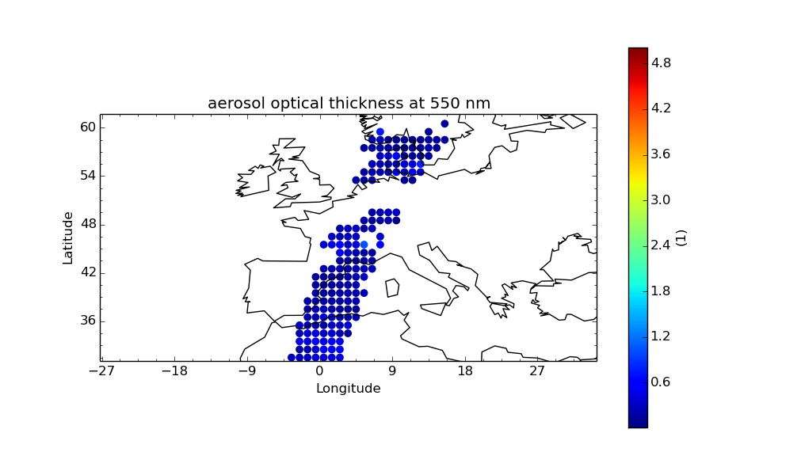

The reverse collocation can be performed with this command (taking about 7 minutes)::

  $ cis col Cloud_Top_Temperature_Mean_Mean:MOD08_E3.A2010009.005.2010026072315.hdf 20080612093821-ESACCI-L2P_AEROSOL-ALL-AATSR_ENVISAT-ORAC_32855-fv02.02.nc:variable=AOD550,collocator=box[h_sep=100,fill_value=-999],kernel=mean -o MOD08_on_AOD550_kdt_hsep_100km_var_full

Plotting it with this command gives the result below::

  $ cis plot Cloud_Top_Temperature_Mean_Mean:cis-MOD08_on_AOD550_kdt_hsep_100km_var_full.nc

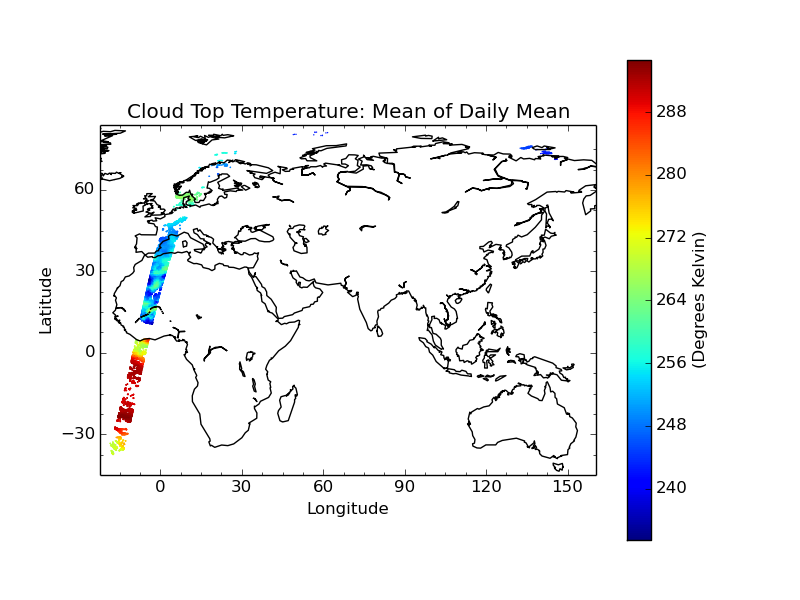

Omitting the variable option in the sample group gives collocated values over a full satellite track (taking about 30 minutes)::

  $ cis col Cloud_Top_Temperature_Mean_Mean:MOD08_E3.A2010009.005.2010026072315.hdf 20080612093821-ESACCI-L2P_AEROSOL-ALL-AATSR_ENVISAT-ORAC_32855-fv02.02.nc:collocator=box[h_sep=100,fill_value=-999],kernel=mean -o MOD08_on_AOD550_kdt_hsep_100km_full

Plotting it with this command gives the result below::

  $ cis plot Cloud_Top_Temperature_Mean_Mean:cis-MOD08_on_AOD550_kdt_hsep_100km_full.nc

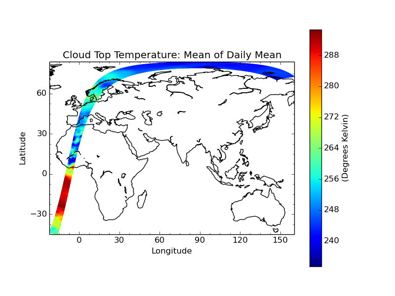

File Locations
^^^^^^^^^^^^^^

The files used above can be found at::

  /group_workspaces/jasmin/cis/jasmin_cis_repo_test_files/
    20080612093821-ESACCI-L2P_AEROSOL-ALL-AATSR_ENVISAT-ORAC_32855-fv02.02.nc
    MOD08_E3.A2010009.005.2010026072315.hdf
  

Examples of collocation of ungridded data on to gridded
=======================================================

Simple Example of Aerosol CCI Data on to a 4x4 Grid
---------------------------------------------------

This is a trivial example that collocates on to a 4x4 spatial grid at a single time::

  $ cis subset tas:tas_day_HadGEM2-ES_rcp45_r1i1p1_20051201-20151130.nc x=[0,2],y=[24,26],t=[2008-06-12T1,2008-06-12] -o tas_day_HadGEM2-ES_rcp45_r1i1p1_20051201-20151130.nc -o tas_1

  $ cis subset AOD550:20080612093821-ESACCI-L2P_AEROSOL-ALL-AATSR_ENVISAT-ORAC_32855-fv02.02.nc x=[0,2],y=[24,26] -o AOD550n_1

  $ cis col AOD550:cis-AOD550n_1.nc tas_1.nc:collocator=bin[fill_value=-9999.0],kernel=mean -o AOD550_on_tas_1

  $ cis plot AOD550:AOD550_on_tas_1.nc

Note that for ungridded gridded collocation, and the collocator must be one bin or box and a kernel such as "mean" must be used.

The plotted image looks like:

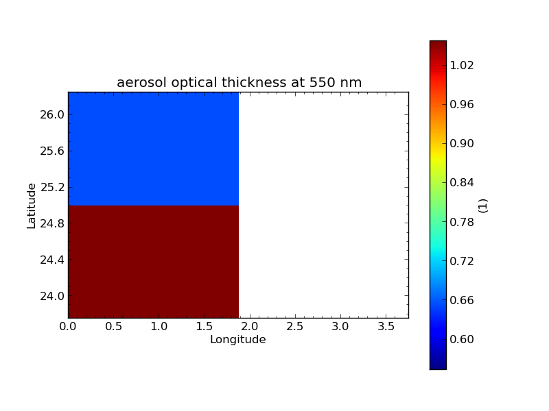

Aerosol CCI with Three Time Steps
---------------------------------

This example involves collocation on to a grid with three time steps. The ungridded data all has times within the middle step, so the output has missing values for all grid points with the time equal to the first or third value. This can be seen using ncdump::

  $ cis subset tas:tas_day_HadGEM2-ES_rcp45_r1i1p1_20051201-20151130.nc x=[-6,-.0001],y=[20,30],t=[2008-06-11T1,2008-06-13] -o tas_3day

  $ cis subset AOD550:20080612093821-ESACCI-L2P_AEROSOL-ALL-AATSR_ENVISAT-ORAC_32855-fv02.02.nc x=[-6,0],y=[20,30] -o AOD550n_3

  $ cis col AOD550:cis-AOD550n_3.nc tas_3day.nc:collocator=bin[fill_value=-9999.0],kernel=mean -o AOD550_on_tas_3day

  $ ncdump AOD550_on_tas_3day.nc |less

Aerosol CCI with One Time Step
------------------------------

This is as above but subsetting the grid to one time step so that the output can be plotted directly::

  $ cis subset tas:tas_day_HadGEM2-ES_rcp45_r1i1p1_20051201-20151130.nc t=[2008-06-12T1,2008-06-12] -o tas_2008-06-12

  $ cis col AOD550:20080612093821-ESACCI-L2P_AEROSOL-ALL-AATSR_ENVISAT-ORAC_32855-fv02.02.nc tas_2008-06-12.nc:collocator=bin[fill_value=-9999.0],kernel=mean -o AOD550_on_tas_1day

  $ cis plot AOD550:AOD550_on_tas_1day.nc
  $ cis plot AOD550:20080612093821-ESACCI-L2P_AEROSOL-ALL-AATSR_ENVISAT-ORAC_32855-fv02.02.nc
  $ cis plot tas:tas_2008-06-12.nc

These are the plots before and after collocation:

.. image:: img/Aerosol_CCI.png
   :width: 300px

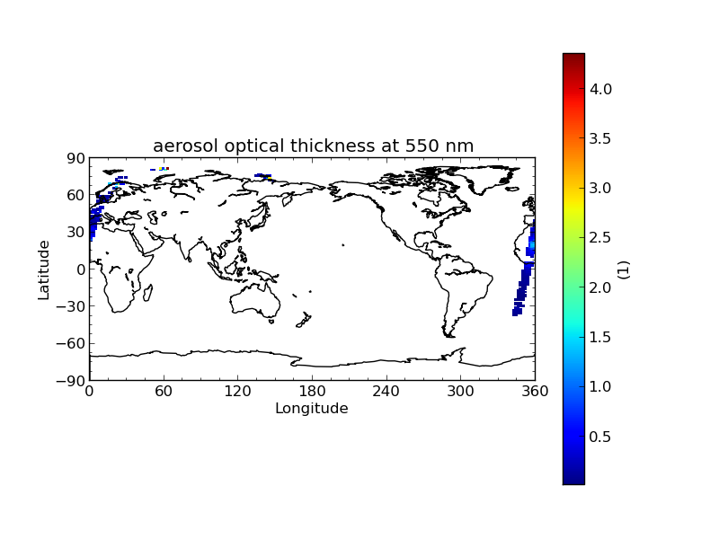

Example with NCAR RAF Data
--------------------------

This example uses the data in RF04.20090114.192600_035100.PNI.nc. However, this file does not have standard_name or units accepted as valid by Iris. These were modified using ncdump and ncgen, giving RF04_fixed_AO2CO2.nc::

  $ cis subset tas:tas_day_HadGEM2-ES_rcp45_r1i1p1_20051201-20151130.nc t=[2009-01-14T1,2009-01-14] -o tas_2009-01-14

  $ cis col AO2CO2:RF04_fixed_AO2CO2.nc tas_2009-01-14.nc:collocator=bin[fill_value=-9999.0],kernel=mean -o RF04_on_tas

  $ cis plot AO2CO2:RF04_on_tas.nc:product=NetCDF_Gridded

These are the plots before and after collocation:

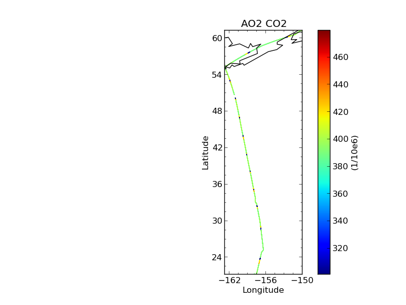

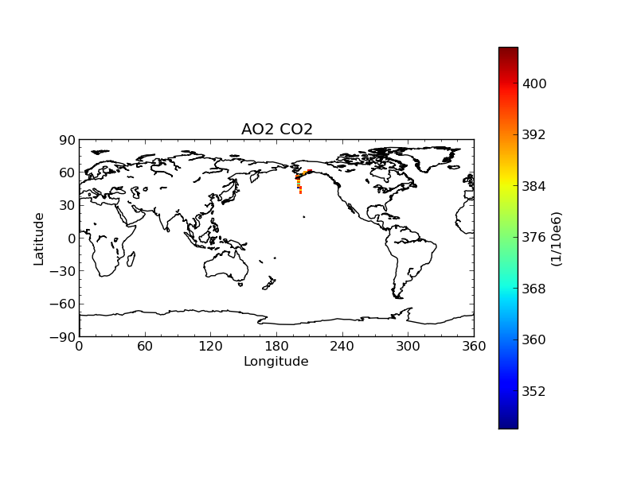

Cloud CCI with One Time Step
----------------------------

This is analogous to the Aerosol CCI example::

  $ cis subset tas:tas_day_HadGEM2-ES_rcp45_r1i1p1_20051201-20151130.nc t=[2008-06-20T1,2008-06-20] -o tas_2008-06-20

  $ cis col cwp:20080620072500-ESACCI-L2_CLOUD-CLD_PRODUCTS-MODIS-AQUA-fv1.0.nc tas_2008-06-20.nc:collocator=bin[fill_value=-9999.0],kernel=mean -o Cloud_CCI_on_tas

  $ cis plot cwp:Cloud_CCI_on_tas.nc
  $ cis plot cwp:20080620072500-ESACCI-L2_CLOUD-CLD_PRODUCTS-MODIS-AQUA-fv1.0.nc

These are the plots before and after collocation:

.. image:: img/Cloud_CCI.png
   :width: 300px

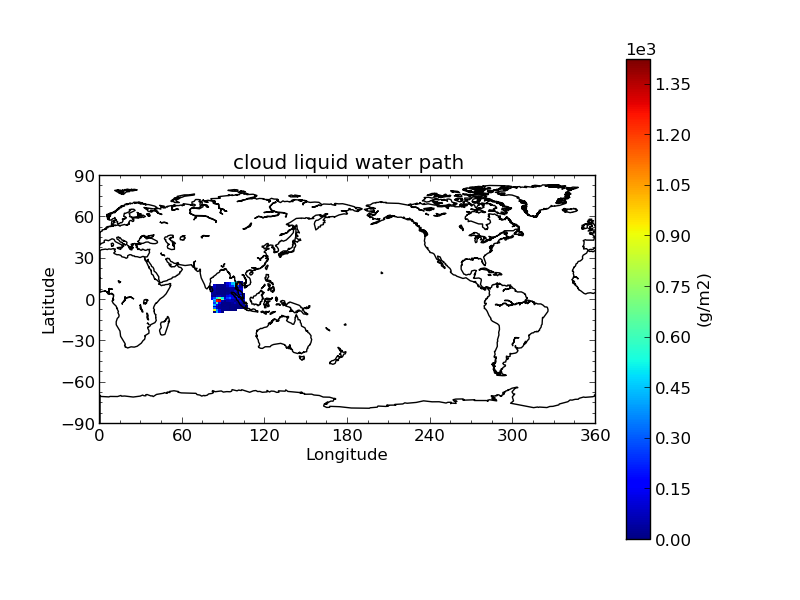

File Locations
--------------

The files used above can be found at::

  /group_workspaces/jasmin/cis/jasmin_cis_repo_test_files/
    20080612093821-ESACCI-L2P_AEROSOL-ALL-AATSR_ENVISAT-ORAC_32855-fv02.02.nc
    20080620072500-ESACCI-L2_CLOUD-CLD_PRODUCTS-MODIS-AQUA-fv1.0.nc
    RF04.20090114.192600_035100.PNI.nc
  /group_workspaces/jasmin/cis/example_data/
    RF04_fixed_AO2CO2.nc
  /group_workspaces/jasmin/cis/gridded-test-data/cmip5.output1.MOHC.HadGEM2-ES.rcp45.day.atmos.day.r1i1p1.v20111128/
    tas_day_HadGEM2-ES_rcp45_r1i1p1_20051201-20151130.nc

Examples of Gridded to Gridded Collocation
==========================================

Example of Gridded Data onto a Finer Grid
-----------------------------------------

First to show original data subset to a single time slice::

  $ cis subset rsutcs:rsutcs_Amon_HadGEM2-A_sstClim_r1i1p1_185912-188911.nc t=[1859-12-12] -o sub1

Plot for subset data::

  $ cis plot rsutcs:sub1.nc

Collocate onto a finer grid, which was created using nearest neighbour::

  $ cis col rsutcs:rsutcs_Amon_HadGEM2-A_sstClim_r1i1p1_185912-188911.nc dummy_high_res_cube_-180_180.nc:collocator=nn -o 2
  $ cis subset rsutcs:2.nc t=[1859-12-12] -o sub2
  $ cis plot rsutcs:sub2.nc

Collocate onto a finer grid, which was created using linear interpolation::

  $ cis col rsutcs:rsutcs_Amon_HadGEM2-A_sstClim_r1i1p1_185912-188911.nc dummy_high_res_cube_-180_180.nc:collocator=lin -o 3
  $ cis subset rsutcs:3.nc t=[1859-12-12] -o sub3
  $ cis plot rsutcs:sub3.nc

Before, after nearest neighbour and after linear interpolation:

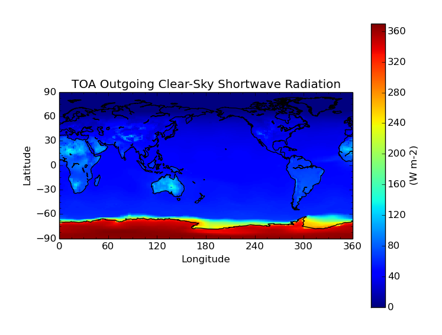

.. image:: img/HorizontalNN.png
   :width: 350px 

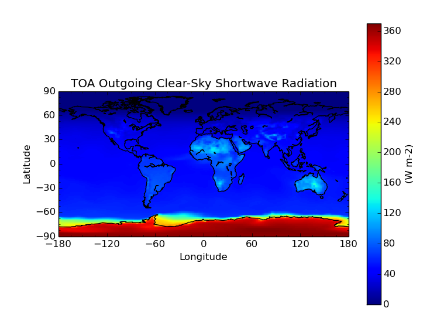

4D Gridded Data with latitude, longitude, air_pressure and time to a New Grid
-----------------------------------------------------------------------------

::

  $ cis col temp:aerocom.INCA.A2.RAD-CTRL.monthly.temp.2006-fixed.nc dummy_low_res_cube_4D.nc:collocator=lin -o 4D-col

Note the file ``aerocom.INCA.A2.RAD-CTRL.monthly.temp.2006-fixed.nc`` has the standard name of ``presnivs`` changed to ``air_pressure``, in order to be read correctly.

Slices at Different Pressures
^^^^^^^^^^^^^^^^^^^^^^^^^^^^^

::

  $ cis subset temp:4D-col.nc t=[2006-01],z=[100000] -o sub9
  $ cis plot temp:sub9.nc
  $ cis subset temp:4D-col.nc t=[2006-01],z=[0] -o sub10
  $ cis plot temp:sub10.nc

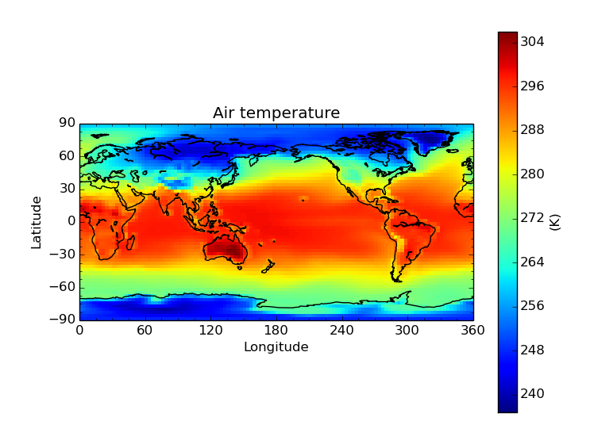

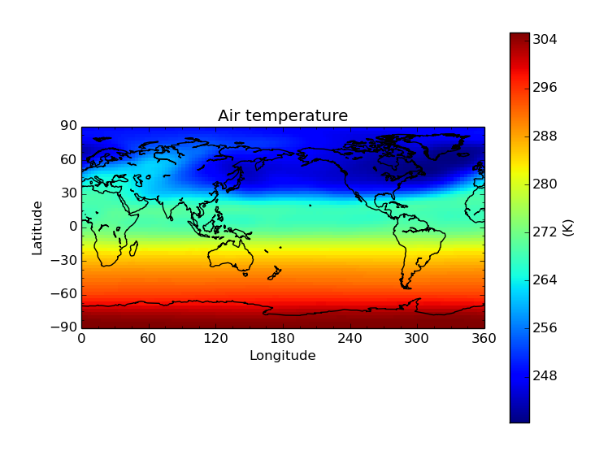

Pressure against time
^^^^^^^^^^^^^^^^^^^^^

::

  $ cis subset temp:4D-col.nc x=[0],t=[2006-01] -o sub11
  $ cis plot temp:sub11.nc --xaxis latitude --yaxis air_pressure
  $ cis subset temp:aerocom.INCA.A2.RAD-CTRL.monthly.temp.2006-fixed.nc x=[0],t=[2006-01] -o sub12
  $ cis plot temp:sub12.nc --xaxis latitude --yaxis air_pressure

.. image:: img/PressureCollocated.png
   :width: 350px 

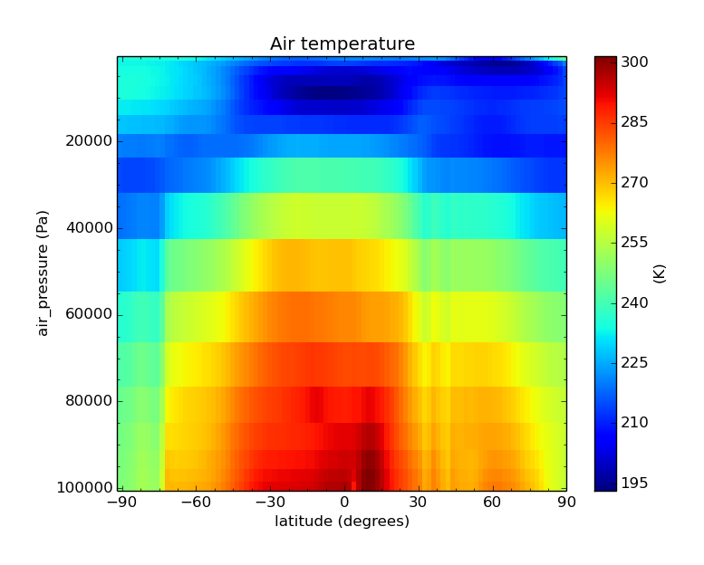

File Locations
--------------

The files used above can be found at::

  /group_workspaces/jasmin/cis/sprint_reviews/SR4-IB/gridded_col2

