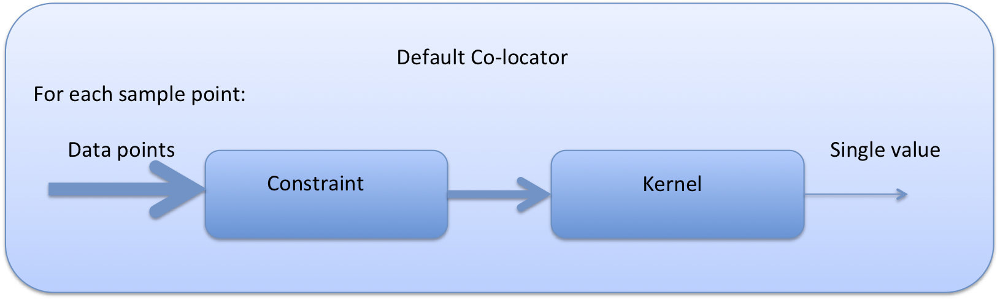
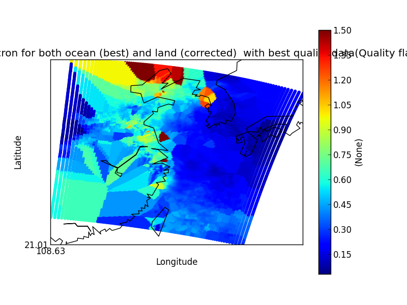
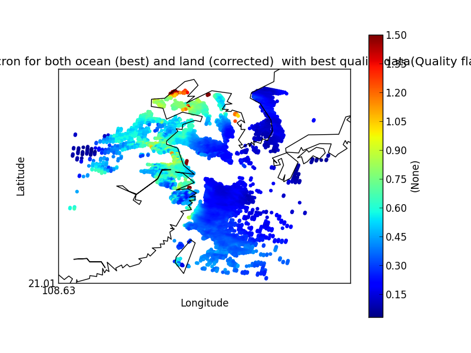
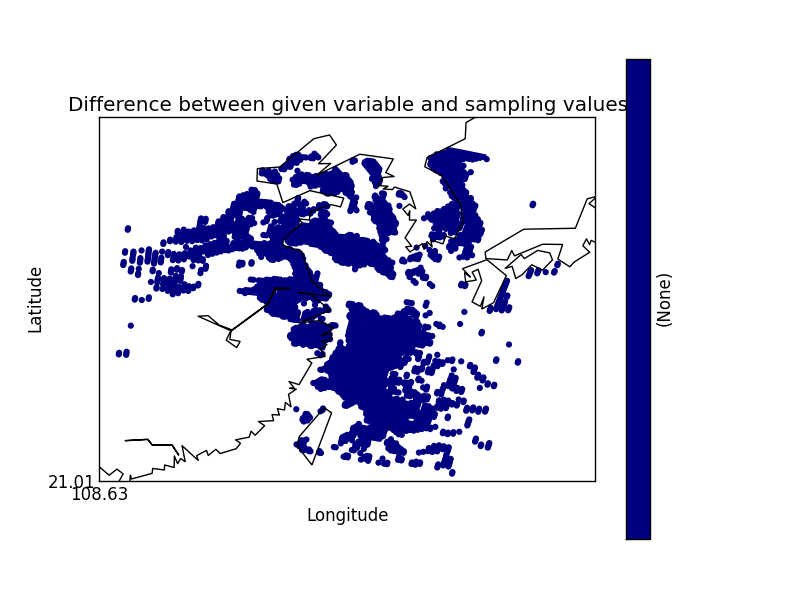

==============================
Performing co-location of data
==============================

One of the key features of the Community Intercomparison Suite (CIS) is the ability to co-locate one or more arbitrary data sets onto a common set of coordinates. This page briefly describes how to perform co-location in a number of scenarios.

To perform co-location, run a command of the format::

  $ cis col datagroup datagroup samplegroup -o outputfile

where:

``datagroup`` 
  is of the format ``variable:filenames[:product]``, where ``product`` is optional.

``filenames`` 
  is a non-optional argument used to specify the files to read the variable from. These can be specified as a comma separated list of the following possibilities:

    #. A single filename - this should be the full path to the file
    #. A single directory - all files in this directory will be read
    #. A wildcarded filename - A filename with any wildcards compatible with the python module glob, so that *, ? and [] can all be used. E.g. /path/to/my/test*file_![0-9]. 

  Note that when using option 2, the filenames in the directory will be automatically sorted into alphabetical order. When using option 3, the filenames matching the wildcard will also be sorted into alphabetical order. The order of the comma separated list will however remain as the user specified, e.g. ``filename1,filename2,wildc*rd,/my/dir/,filename3``, would read ``filename1``, then ``filename2``, then all the files that match ``"wildc*rd"`` (in alphabetical order), then all the files in the directory ``"/my/dir/"`` (in alphabetical order) and then finally ``filename3``.

``samplegroup``
  is of the format ``filename:options`` The available options are described in more detail below. They are entered in a comma separated list, such as ``variable=Temperature,kernel=nn_horizontal``.
  
    #. ``filename`` is a single filename with the points to colocate onto.  
    #. ``variable`` is an optional argument used to specify which variable's coordinates to use for colocation.
    #. ``colocationmethod`` is an optional argument used to specify the colocation method to use, DefaultColocator is used if none is specified. The built-in colocation methods currently available are:
    
      #. DefaultColocator - For each point in the sampling this colocation method performs one call to the given constraint method and then a single call to the kernel, returning exactly one data object. The user is able to specify a number of parameters to refine the output variable, each of these are assumed to be as from the original data file if not specified:

        #. var_name - Specify the name of the variable in the resulting NetCDF file
        #. var_long_name - Specify the variable's long name
        #. var_units - Specify the variable's units

      #. !DebugColocator - As the default colocation method but with added timing messages, useful for debugging.

        #. max_vals - Specify the maximum number of sample points to evaluate
        #. print_step - Specify the frequency of printing timing information e.g. print_step=100 would print every 100 steps

     #. DummyColocator - This performs a null colocation, that is it just returns the original data object for writing to file. This might be useful if variables from the original sample file are wanted in the output file but are already on the correct grid.
     #. AverageColocator - A special co-locator which returns three separate variables, one for each for the mean, standard deviation and the number of points which went into calculating those values

       #. var_name - Specify the name of the variable in the resulting NetCDF file. The default is the data variable name suffixed with ``_mean``
       #. var_long_name - Specify the variable's long name
       #. var_units - Specify the variable's units
       #. stddev_name - Specify the name of the standard deviation variable in the resulting NetCDF file. The default is the variable name suffixed with ``_std_dev``.
       #. nopoints_name - Specify the name of the variable containing the number of points in the resulting NetCDF file. The default is the variable name suffixed with ``_no_points``

     #. DifferenceColocator - A special co-locator which returns two seperate variables. The value obtained using the kernel specified and the difference between this value and the value specified from the sample variable. Obviously, this requires a variable to be specified in the samplegroup.

       #. var_name - Specify the name of the variable in the resulting NetCDF file
       #. var_long_name - Specify the variable's long name
       #. var_units - Specify the variable's units
       #. diff_name - Specify the name of the difference variable in the resulting NetCDF file. The default is ``difference``
       #. diff_long_name - Specify the long name of the difference variable.

     #. GriddedColocator - A colocator for colocating gridded data onto a new grid. All coordinates that are present in both files will be colocated. Any coordinates in the new grid, that are not in the data grid, are lost. Any coordinates in the data grid, that are not in the new grid, are kept as they are.
     #. GriddedColocatorUsingIrisRegrid - As for GriddedColocator, but uses Iris's regrid method. This only works for colocating on to a new horizontal grid, no other coordinates are colocated.
     #. UngriddedGriddedColocator - This is for colocating ungridded data on to a grid. It should be used with either the CubeCellConstraint or BinningCubeCellConstraint constraint and the 'mean' kernel.

``constraint``
  is an optional argument used to specify the constraint method to use, no constraints are used if none is specified. The built-in constraint methods currently available are:
 
    #. SepConstraint - A method which constrains the sample points based on spatial and temporal separation. This method takes five optional arguments, enclosed in square braces such as ``SepConstraint[h_sep=5km,p_sep=2,t_sep=1d]``.

      #. h_sep - the horizontal separation in kilometres. The units can be specified as km or m (for example ``h_sep=1.5km``), if none are specified then the default is km.
      #. a_sep - the altitude separation. The units can be specified as km or m, as for h_sep.
      #. p_sep - the pressure separation. This is not an absolute separation as for h_sep and a_sep, but a relative one, so is specified as a ratio. For example a constraint of p_sep = 2, for a point at 10 hPa, would cover the range 5 hPa < points < 20 hPa. Note that p_sep >= 1.
      #. t_sep - the time separation. This can be specified in years, months, days, hours, minutes or seconds using "$y$m$d$H$M$S". For example to specify a time seperation of one and a half months you could use ``t_sep=1m15d``. It is worth noting that the units for time comparison are fractional days, so that years are converted to the number of days in a Gregorian year, and months are 1/12th of a Gregorian year.
      #. fill_value - The numerical value to apply to the colocated point if there are no points which satisfy the constraint.

    #. CubeCellConstraint - This can only be used for colocating on to a grid. It constrains to points within the bounds surrounding each grid point. The bounds are taken from the gridded data if they are defined, otherwise the mid-points between grid points are used. This constraint is implemented by checking every data point for every grid point with nested iteration, so can be slow. One option is available:

      #. fill_value - The numerical value to apply to the colocated point if there are no points which satisfy the constraint.

    #. BinningCubeCellConstraint - This returns the same result as CubeCellConstraint but using a different algorithm. The grid cell in which each data point falls is determined by iterating over the data points and assigning them to bins. The constraint then iterates over the grid points, retrieving the binned data points for each grid point. This is computationally much more efficient, but uses more memory.One option is available:

      #. fill_value - The numerical value to apply to the colocated point if there are no points which satisfy the constraint.

`` kernel ``
  is an optional argument used to specify the kernel to use, a nearest neighbour algorithm is used if none is specified (nn_gridded for gridded-ungridded colocation and nn_horizontal otherwise). The built-in colocation methods currently available, for colocating onto ungridded data, are:

  #. nn_gridded - nearest neighbour algorithm optimized for gridded data, this is the default for gridded data.
  #. li - A linear interpolation algorithm, this is only suitable for gridded data.
  #. nn_time - nearest neighbour in time algorithm for ungridded data.
  #. nn_horizontal - nearest neighbour in horizontal distance, for ungridded data.
  #. nn_altitude - nearest neighbour in altitude, for ungridded data.
  #. nn_pressure - nearest neighbour in pressure (as in a vertical coordinate), for ungridded data. Note that similarly to the p_sep constraint that this works on the ratio of pressure, so the nearest neighbour to a point with a value of 10 hPa, out of a choice of 5 hPa and 19 hPa, would be 19 hPa, as 19/10 < 10/5.
  #. mean - an averaging kernel which returns the mean values of any points remaining after the specified Constraint has been applied (note that no constraint is the default)
  #. full_average - an averaging kernel which returns the mean, standard deviation and the number of points remaining after the specified Constraint has been applied
   For colocating on to gridded data the default kernel is ``gridded_gridded_nn``. The two options available are:

    #. gridded_gridded_nn - nearest neighbour for gridded-gridded colocation
    #. gridded_gridded_li - linear interpolation for gridded-gridded colocation

``product``
  is an optional argument used to specify the type of files being read. If omitted, the program will attempt to figure out which product to use based on the filename. 

.. todo:: Link to DataProduct wiki page.  Click [CommunityIntercomparisonSuite/DataProduct here] to see a list of available products and their file signatures.

`` outputfile ``
  is an optional argument to specify the name to use for the file output. This is automatically given a .nc extension and prepended with cis-col out to make it distinguishable as a colocated file.

A full example would be::

  $ cis col rain:"my_data_??.*" my_sample_file:constraint=SepConstraint[h_sep=50km,t_sep=6000S],kernel=nn_time -o my_col

More Examples
=============

The following pages give more examples of colocation:

.. todo:: link to the Colocation examples UngriddedGriddedColationExamples, etc.

Colocation output files
=======================

All co-location output files are prefixed with ``cis-col`` and suffixed with ``.nc`` (so there is no need to specify the extension in the output parameter). This is to ensure the !CisCol data product is always used to read co-located data.

It is worth noting that in the process of colocation all of the data and sample points are represented as 1-d lists, so any structural information about the input files is lost. This is done to ensure consistency in the colocation output. This means, however, that input files which may have been plotable as, for example, a heatmap may not be after co-location. In this situation plotting the data as a scatter plot will yield the required results. 

Each co-located output variable has a history attributed created (or appended to) which contains all of the parameters and file names which went into creating it. An example might be::

  double mass_fraction_of_cloud_liquid_water_in_air(pixel_number) ;
      ...
      mass_fraction_of_cloud_liquid_water_in_air:history = "Colocated onto sampling from:   [\'/test/test_files/RF04.20090114.192600_035100.PNI.nc\'] using CIS version V0R4M4\n",
          "variable: mass_fraction_of_cloud_liquid_water_in_air\n",
          "with files: [\'/test/test_files/xenida.pah9440.nc\']\n",
          "using colocator: DifferenceColocator\n",
          "colocator parameters: {}\n",
          "constraint method: None\n",
          "constraint parameters: None\n",
          "kernel: None\n",
          "kernel parameters: None" ;
      mass_fraction_of_cloud_liquid_water_in_air:shape = 30301 ;
  double difference(pixel_number) ;
      ...

Basic colocation design
=======================

The diagram below demonstrates the basic design of the co-location system, and the roles of each of the components. In the simple case of the default co-locator (which returns only one value) the Colocator loops over each of the sample points, calls the relevant Constraint to reduce the number of data points, and then the kernel which returns a single value which the co-locator stores.

It is useful to understand that when a sample variable is specified that contains masked values (those with a fill_value) this is not taken into account when creating the list of sample points. E.g. the full list of coordinates is used from the file, regardless of the values of the sample variable.

On the contrary when a data variable is read in (which is to be co-located onto the sample) any masked values are ignored. That is, any value in the data variable which is equal to the fill_value is not considered for colocation, as it is treated as an empty value.

On their own each of these statements seem sensible, but together may lead to unexpected results if, for example, a variable from a file is co-located onto itself using the !DefaultColocator. In this situation, the sampling from the file is used to determine the sample points regardless of fill_value, and the variable is co-located on to this (ignoring any fill_values). This results in an output file where the masked (or missing) values are 'filled-in' by the co-locator using whichever kernel was specified - see Figure 2a below. Using the !DummyColocator simply returns the original masked values as no filling in is done (see 2b), and similarly for the difference co-locator when co-located onto itself the difference variable retains the mask as a non-value minus any other number is still a non-value (see 2c).

   
   Figure 2a

   Figure 2b

   Figure 2c

Writing your own plugins
========================

The colocation framework was designed to make it easy to write your own plugins. Plugins can be written to create new kernels, new constraint methods and even whole colocation methods. See Design#Colocation for more details

.. todo:: link to Design wiki

