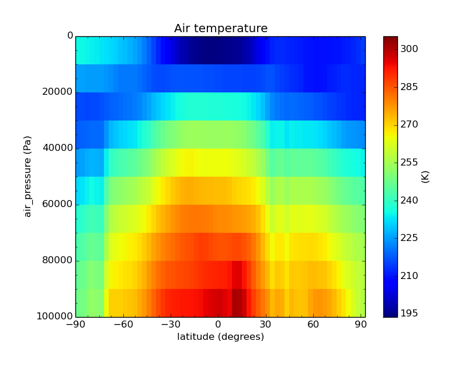

===================
Colocation Examples
===================

Ungridded to Ungridded Colocation Examples
==========================================

Ungridded data with vertical component
--------------------------------------

First subset two Caliop data files::

  $ cis subset Temperature:CAL_LID_L2_05kmAPro-Prov-V3-01.2009-12-31T23-36-08ZN.hdf x=[170,180],y=[60,80],z=[28000,29000],p=[13,15] -o 2009
  $ cis subset Temperature:CAL_LID_L2_05kmAPro-Prov-V3-01.2010-01-01T00-22-28ZD.hdf x=[170,180],y=[60,80],z=[28000,29000],p=[12,13.62] -o 2010

Results of subset can be plotted with::

  $ cis plot Temperature:cis-2009.nc --itemwidth 25 --xaxis time --yaxis air_pressure
  $ cis plot Temperature:cis-2010.nc --itemwidth 25 --xaxis time --yaxis air_pressure

Then colocate data, and plot output::

  $ cis col Temperature:cis-2010.nc cis-2009.nc:kernel=nn_pressure
  $ cis plot Temperature:cis-out.nc --itemwidth 25 --xaxis time --yaxis air_pressure

The output for the two subset data files, and the colocated data should look like:

.. image:: img/2009-subset.png
   :width: 300px

.. image:: img/2010-subset.png
   :width: 300px

.. image:: img/PressureColocation.png
   :width: 300px

File Locations
^^^^^^^^^^^^^^

The files used above can be found at::

  /group_workspaces/jasmin/cis/data/caliop/CAL-LID-L2-05km-APro

Ungridded data colocation using k-D tree indexing
-------------------------------------------------

These examples show the syntax for using the k-D tree optimisation of the nearest-neighbour kernel and separation constraint. The indexing is only by horizontal position.

Nearest-Neighbour Kernel
^^^^^^^^^^^^^^^^^^^^^^^^

The first example is of Aerosol CCI data on to the points of a MODIS L3 file (which is an ungridded data file but with points lying on a grid).

Subset to a relevant region::

  $ cis subset AOD550:20080612093821-ESACCI-L2P_AEROSOL-ALL-AATSR_ENVISAT-ORAC_32855-fv02.02.nc x=[-6,0],y=[20,30] -o AOD550n_3
  $ cis subset Cloud_Top_Temperature_Mean_Mean:MOD08_E3.A2010009.005.2010026072315.hdf x=[-6,0],y=[20,30] -o MOD08n_3

The results of subsetting can be plotted with::

  $ cis plot AOD550:cis-AOD550n_3.nc --itemwidth 10
  $ cis plot Cloud_Top_Temperature_Mean_Mean:cis-MOD08n_3.nc --itemwidth 20

These should look like:

.. image:: img/AOD550n_3.png
   :width: 300px

.. image:: img/MOD08n_3.png
   :width: 300px

To colocate with the nearest-neighbour kernel use::

  $ cis col Cloud_Top_Temperature_Mean_Mean:cis-MOD08n_3.nc cis-AOD550n_3.nc:kernel=nn_horizontal_kdtree -o MOD08_on_AOD550_nn_kdt

This can be plotted with::

  $ cis plot Cloud_Top_Temperature_Mean_Mean:cis-MOD08_on_AOD550_nn_kdt.nc --itemwidth 10

The sample points are more closely spaced than the data points, hence a patchwork effect is produced.

.. image:: img/MOD08_on_AOD550_nn_kdt.png
   :width: 300px

Colocating the full Aerosol CCI file on to the MODIS L3 (taking around 2 hours) with::

  $ cis col AOD550:20080612093821-ESACCI-L2P_AEROSOL-ALL-AATSR_ENVISAT-ORAC_32855-fv02.02.nc MOD08_E3.A2010009.005.2010026072315.hdf:variable=Cloud_Top_Temperature_Mean_Mean,kernel=nn_horizontal_kdtree -o AOD550_on_MOD08_kdt_nn_full.nc

gives the following result

.. image:: img/AOD550_on_MOD08_kdt_nn_full.png
   :width: 300px

A separation constraint is needed to obtain a more useful result.

Separation Constraint
^^^^^^^^^^^^^^^^^^^^^
This exmple is similar to the first nearest-neighbour colocation above::

  $ cis col Cloud_Top_Temperature_Mean_Mean:cis-MOD08n_3.nc cis-AOD550n_3.nc:kernel=mean,constraint=SepConstraintKdtree[h_sep=75] -o MOD08_on_AOD550_hsep_75km

Plotting this again gives a granular result::

  $ cis plot Cloud_Top_Temperature_Mean_Mean:cis-MOD08_on_AOD550_hsep_75km.nc --itemwidth 10

.. image:: img/MOD08_on_AOD550_hsep_75km.png
   :width: 300px

This example colocates the Aerosol CCI data on to the MODIS L3 grid::

  $ cis col AOD550:20080612093821-ESACCI-L2P_AEROSOL-ALL-AATSR_ENVISAT-ORAC_32855-fv02.02.nc MOD08_E3.A2010009.005.2010026072315.hdf:variable=Cloud_Top_Temperature_Mean_Mean,kernel=mean,constraint=SepConstraintKdtree[h_sep=50,fill_value=-999] -o AOD550_on_MOD08_kdt_hsep_50km_full.nc

This can be plotted as follows, with the full image and zoomed into a representative section show below::

  $ cis plot AOD550:cis-AOD550_on_MOD08_kdt_hsep_50km_full.nc --itemwidth 50

.. image:: img/AOD550_on_MOD08_kdt_hsep_50km_full.png
   :width: 300px

.. image:: img/AOD550_on_MOD08_kdt_hsep_50km_full_zoom.png
   :width: 300px

The reverse colocation can be performed with this command (taking about 30 minutes)::

  $ cis col Cloud_Top_Temperature_Mean_Mean:MOD08_E3.A2010009.005.2010026072315.hdf 20080612093821-ESACCI-L2P_AEROSOL-ALL-AATSR_ENVISAT-ORAC_32855-fv02.02.nc:variable=AOD550,kernel=mean,constraint=SepConstraintKdtree[h_sep=100,fill_value=-999] -o MOD08_on_AOD550_kdt_hsep_100km_full

Plotting it with this command gives the result below::

  $ cis plot Cloud_Top_Temperature_Mean_Mean:cis-MOD08_on_AOD550_kdt_hsep_100km_full.nc

.. image:: img/MOD08_on_AOD550_kdt_hsep_100km_full.png
   :width: 300px

File Locations
^^^^^^^^^^^^^^

The files used above can be found at::

  /group_workspaces/jasmin/cis/jasmin_cis_repo_test_files/
    20080612093821-ESACCI-L2P_AEROSOL-ALL-AATSR_ENVISAT-ORAC_32855-fv02.02.nc
    MOD08_E3.A2010009.005.2010026072315.hdf
  

Examples of co-location of ungridded data on to gridded
=======================================================

Simple Example of Aerosol CCI Data on to a 4x4 Grid
---------------------------------------------------

This is a trivial example that co-locates on to a 4x4 spatial grid at a single time::

  $ cis subset tas:tas_day_HadGEM2-ES_rcp45_r1i1p1_20051201-20151130.nc:NetCDFGriddedByVariableName x=[0,2],y=[24,26],t=[2008-06-12T1,2008-06-12] -o tas_day_HadGEM2-ES_rcp45_r1i1p1_20051201-20151130.nc -o tas_1

  $ cis subset AOD550:20080612093821-ESACCI-L2P_AEROSOL-ALL-AATSR_ENVISAT-ORAC_32855-fv02.02.nc x=[0,2],y=[24,26] -o AOD550_1

  $ cis col atmosphere_optical_thickness_due_to_aerosol:cis-AOD550_1.nc cis-tas_1.nc:product=NetCDFGriddedByVariableName,colocator=UngriddedGriddedColocator,constraint=CubeCellConstraint[fill_value=-9999.0],kernel=mean -o AOD550_on_tas_1

  $ cis plot atmosphere_optical_thickness_due_to_aerosol:cis-AOD550_on_tas_1.nc:product=NetCDFGriddedByVariableName

Note that the colocator is always UngriddedGriddedColocator for ungridded gridded co-location and the constraint must be one CubeCellConstraint or BinningCubeCellConstraint (the latter being faster at the expense of using more memory). The kernel "mean" would normally be used.

The plotted image looks like:

.. image:: img/Aerosol_CCI_4x4.png
   :width: 300px
   :align: center

Aerosol CCI with Three Time Steps
---------------------------------

This example involves co-location on to a grid with three time steps. The ungridded data all has times within the middle step, so the output has missing values for all grid points with the time equal to the first or third value. This can be seen using ncdump::

  $ cis subset tas:tas_day_HadGEM2-ES_rcp45_r1i1p1_20051201-20151130.nc:NetCDFGriddedByVariableName x=[-6,-.0001],y=[20,30],t=[2008-06-11T1,2008-06-13] -o tas_3day

  $ cis subset AOD550:20080612093821-ESACCI-L2P_AEROSOL-ALL-AATSR_ENVISAT-ORAC_32855-fv02.02.nc x=[-6,0],y=[20,30] -o AOD550_3

  $ cis col atmosphere_optical_thickness_due_to_aerosol:cis-AOD550_3.nc cis-tas_3day.nc:product=NetCDFGriddedByVariableName,colocator=UngriddedGriddedColocator,constraint=BinningCubeCellConstraint[fill_value=-9999.0],kernel=mean -o AOD550_on_tas_3day

  $ ncdump cis-AOD550_on_tas_3day.nc |less

Aerosol CCI with One Time Step
------------------------------

This is as above but subsetting the grid to one time step so that the output can be plotted directly::

  $ cis subset tas:tas_day_HadGEM2-ES_rcp45_r1i1p1_20051201-20151130.nc:NetCDFGriddedByVariableName t=[2008-06-12T1,2008-06-12] -o tas_2008-06-12

  $ cis col AOD550:20080612093821-ESACCI-L2P_AEROSOL-ALL-AATSR_ENVISAT-ORAC_32855-fv02.02.nc cis-tas_2008-06-12.nc:product=NetCDFGriddedByVariableName,colocator=UngriddedGriddedColocator,constraint=BinningCubeCellConstraint[fill_value=-9999.0],kernel=mean -o AOD550_on_tas_1day

  $ cis plot AOD550:cis-AOD550_on_tas_1day.nc:product=NetCDFGriddedByVariableName
  $ cis plot AOD550:20080612093821-ESACCI-L2P_AEROSOL-ALL-AATSR_ENVISAT-ORAC_32855-fv02.02.nc
  $ cis plot tas:cis-tas_2008-06-12.nc:product=NetCDFGriddedByVariableName

These are the plots before and after co-location:

.. image:: img/Aerosol_CCI.png
   :width: 300px

.. image:: img/Aerosol_CCI_col.png
   :width: 300px

Example with NCAR RAF Data
--------------------------

This example uses the data in RF04.20090114.192600_035100.PNI.nc. However, this file does not have standard_name or units accepted as valid by Iris. These were modified using ncdump and ncgen, giving RF04_fixed_AO2CO2.nc::

  $ cis subset tas:tas_day_HadGEM2-ES_rcp45_r1i1p1_20051201-20151130.nc:NetCDFGriddedByVariableName t=[2009-01-14T1,2009-01-14] -o tas_2009-01-14

  $ cis col AO2CO2:RF04_fixed_AO2CO2.nc cis-tas_2009-01-14.nc:product=NetCDFGriddedByVariableName,colocator=UngriddedGriddedColocator,constraint=BinningCubeCellConstraint[fill_value=-9999.0],kernel=mean -o RF04_on_tas

  $ cis plot AO2CO2:cis-RF04_on_tas.nc:product=NetCDFGriddedByVariableName

These are the plots before and after co-location:

.. image:: img/RF04.png
   :width: 300px

.. image:: img/RF04_col.png
   :width: 300px

Cloud CCI with One Time Step
----------------------------

This is analogous to the Aerosol CCI example::

  $ cis subset tas:tas_day_HadGEM2-ES_rcp45_r1i1p1_20051201-20151130.nc:NetCDFGriddedByVariableName t=[2008-06-20T1,2008-06-20] -o tas_2008-06-20

  $ cis col cwp:20080620072500-ESACCI-L2_CLOUD-CLD_PRODUCTS-MODIS-AQUA-fv1.0.nc cis-tas_2008-06-20.nc:product=NetCDFGriddedByVariableName,colocator=UngriddedGriddedColocator,constraint=BinningCubeCellConstraint[fill_value=-9999.0],kernel=mean -o Cloud_CCI_on_tas

  $ cis plot cwp:cis-Cloud_CCI_on_tas.nc:product=NetCDFGriddedByVariableName
  $ cis plot cwp:20080620072500-ESACCI-L2_CLOUD-CLD_PRODUCTS-MODIS-AQUA-fv1.0.nc

These are the plots before and after co-location:

.. image:: img/Cloud_CCI.png
   :width: 300px

.. image:: img/Cloud_CCI_col.png
   :width: 300px

File Locations
--------------

The files used above can be found at::

  /group_workspaces/jasmin/cis/jasmin_cis_repo_test_files/
    20080612093821-ESACCI-L2P_AEROSOL-ALL-AATSR_ENVISAT-ORAC_32855-fv02.02.nc
    20080620072500-ESACCI-L2_CLOUD-CLD_PRODUCTS-MODIS-AQUA-fv1.0.nc
    RF04.20090114.192600_035100.PNI.nc
  /group_workspaces/jasmin/cis/example_data/
    RF04_fixed_AO2CO2.nc
  /group_workspaces/jasmin/cis/gridded-test-data/cmip5.output1.MOHC.HadGEM2-ES.rcp45.day.atmos.day.r1i1p1.v20111128/
    tas_day_HadGEM2-ES_rcp45_r1i1p1_20051201-20151130.nc

Examples of Gridded to Gridded Colocation
=========================================

Example of Gridded Data onto a Finer Grid
-----------------------------------------

First to show original data subset to a single time slice::

  $ cis subset rsutcs:rsutcs_Amon_HadGEM2-A_sstClim_r1i1p1_185912-188911.nc:NetCDFGriddedByVariableName t=[1859-12-12] -o sub1

Plot for subset data::

  $ cis plot rsutcs:cis-sub1.nc:product=NetCDFGriddedByVariableName

Colocate onto a finer grid, which was created using nearest neighbour::

  $ cis col rsutcs:rsutcs_Amon_HadGEM2-A_sstClim_r1i1p1_185912-188911.nc:product=NetCDFGriddedByVariableName dummy_high_res_cube_-180_180.nc:colocator=GriddedColocator,kernel=gridded_gridded_nn,product=NetCDF_CF_Gridded -o 2
  $ cis subset rsutcs:cis-2.nc:NetCDFGriddedByVariableName t=[1859-12-12] -o sub2
  $ cis plot rsutcs:cis-sub2.nc:product=NetCDFGriddedByVariableName

Colocate onto a finer grid, which was created using linear interpolation::

  $ cis col rsutcs:rsutcs_Amon_HadGEM2-A_sstClim_r1i1p1_185912-188911.nc:product=NetCDFGriddedByVariableName dummy_high_res_cube_-180_180.nc:colocator=GriddedColocator,kernel=gridded_gridded_li,product=NetCDF_CF_Gridded -o 2
  $ cis subset rsutcs:cis-3.nc:NetCDFGriddedByVariableName t=[1859-12-12] -o sub3
  $ cis plot rsutcs:cis-sub3.nc:product=NetCDFGriddedByVariableName

Plot colocated data::

  $ cis plot toa_outgoing_shortwave_flux_assuming_clear_sky:cis-out.nc:product=NetCDF_CF_Gridded

Before, after nearest neighbour and after linear interpolation:

.. image:: img/OriginalData.png
   :width: 350px 

.. image:: img/HorizontalNN.png
   :width: 350px 

.. image:: img/HorizontalLI.png
   :width: 350px

4D Gridded Data with latitude, longitude, air_pressure and time to a New Grid
-----------------------------------------------------------------------------

::

  $ cis col temp:aerocom.INCA.A2.RAD-CTRL.monthly.temp.2006-fixed.nc:product=NetCDFGriddedByVariableName dummy_low_res_cube_4D.nc:product=NetCDFGriddedByVariableName,colocator=GriddedColocator,kernel=gridded_gridded_li -o 4D-col

Note the file ``aerocom.INCA.A2.RAD-CTRL.monthly.temp.2006-fixed.nc`` has the standard name of ``presnivs`` changed to ``air_pressure``, in order to be read correctly.

Slices at Different Pressures
.............................

::

  $ cis subset temp:cis-4D-col.nc:NetCDFGriddedByVariableName t=[2006-01],z=[100000] -o sub9
  $ cis plot temp:cis-sub9.nc:product=NetCDFGriddedByVariableName
  $ cis subset temp:cis-4D-col.nc:NetCDFGriddedByVariableName t=[2006-01],z=[0] -o sub10
  $ cis plot temp:cis-sub10.nc:product=NetCDFGriddedByVariableName

.. image:: img/PressureSlice1.png
   :width: 350px 

.. image:: img/PressureSlice2.png
   :width: 350px

Pressure against time
.....................

::

  $ cis subset temp:cis-4D-col.nc:NetCDFGriddedByVariableName x=[0],t=[2006-01] -o sub11
  $ cis plot temp:cis-sub11.nc:product=NetCDFGriddedByVariableName --xaxis latitude --yaxis air_pressure
  $ cis subset temp:aerocom.INCA.A2.RAD-CTRL.monthly.temp.2006-fixed.nc:NetCDFGriddedByVariableName x=[0],t=[2006-01] -o sub12
  $ cis plot temp:cis-sub12.nc:product=NetCDFGriddedByVariableName --xaxis latitude --yaxis air_pressure

.. image:: img/PressureOriginal.png
   :width: 350px

File Locations
--------------

The files used above can be found at::

  /group_workspaces/jasmin/cis/sprint_reviews/SR4-IB/gridded_col2
