.. |nbsp| unicode:: 0xA0

====================================
What kind of data can CIS deal with?
====================================

Writing
=======

When creating files from a CIS command, CIS uses the NetCDF 4 classic format. Ungridded output files are always
prefixed with ``cis-``, and both ungridded and gridded output are always suffixed with ``.nc``.

.. _data-products-reading:

Reading
=======

CIS has built-in support for NetCDF and HDF4 file formats. That said, most data requires some sort of pre-processing
before being ready to be plotted or analysed (this could be scale factors or offsets needing to applied, or even just
knowing what the dependencies between variables are). For that reason, the way CIS deals with reading in data files
is via the concept of "data products". Each product has its own very specific way of reading and interpreting the data
in order for it to be ready to be plotted, analysed, etc.

So far, CIS can read the following ungridded data files:

  ================ ====================== =================  ========================================================================================================
  Dataset          Product name           Type               File Signature
  ================ ====================== =================  ========================================================================================================
  AERONET          Aeronet                Ground-stations    \*.lev20
  Aerosol CCI      Aerosol_CCI            Satellite          \*ESACCI*AEROSOL*
  CALIOP L1        Caliop_L1              Satellite          CAL_LID_L1-ValStage1-V3*.hdf
  CALIOP L2        Caliop_L2              Satellite          CAL_LID_L2_05kmAPro-Prov-V3*.hdf
  CloudSat         CloudSat               Satellite          \*_CS_*GRANULE*.hdf
  Flight campaigns NCAR_NetCDF_RAF        Aircraft           RF*.nc
  MODIS L2         MODIS_L2               Satellite          \*MYD06_L2*.hdf, \*MOD06_L2*.hdf, \*MYD04_L2*.hdf, \*MOD04_L2*.hdf, \*MYDATML2.*.hdf, \*MODATML2*.hdf
  Cloud CCI        Cloud_CCI              Satellite          \*ESACCI*CLOUD*
  CSV datapoints   ASCII_Hyperpoints      N/A                \*.txt
  CIS ungridded    cis                    CIS output         cis-\*.nc
  NCAR-RAF         NCAR_NetCDF_RAF        Aircraft           \*.nc containing the attribute Conventions with the value NCAR-RAF/nimbus
  GASSP            NCAR_NetCDF_RAF        Aircraft           \*.nc containing the attribute GASSP_Version
  GASSP            NCAR_NetCDF_RAF        Ship               \*.nc containing the attribute GASSP_Version, with no altitude
  GASSP            NCAR_NetCDF_RAF        Ground-station     \*.nc containing the attribute GASSP_Version, with attributes Station_Lat, Station_Lon and Station_Altitude
  ================ ====================== =================  ========================================================================================================

It can also read the following gridded data types:

  ==================== =========================== ================== =================================================================================
  Dataset              Product name                Type               File Signature                                      
  ==================== =========================== ================== =================================================================================
  MODIS L3 daily       MODIS_L3                    Satellite          \*MYD08_D3*.hdf, \*MOD08_D3*.hdf, \*MOD08_E3*.hdf
  HadGEM pp data       HadGEM_PP                   Gridded Model Data \*.pp
  Net_CDF Gridded Data NetCDF_Gridded              Gridded Model Data \*.nc (this is the default for NetCDF Files that do not match any other signature)
  ==================== =========================== ================== =================================================================================

The file signature is used to automatically recognise which product definition to use. Note the product can overridden
easily by being specified at the command line.

This is of course far from being an exhaustive list of what's out there. To cope with this, a "plugin" architecture has
been designed so that the user can readily use their own data product reading routines, without even having to change
the code - see Design Maintenance Guide for more information.

.. todo:: [CommunityIntercomparisonSuite/Design Maintenance Guide]

the plugins are always read first, so one can also overwrite default behaviour if the built-in products listed above
do not achieve a very specific purpose.

.. _datagroups:

Datagroups
==========
Most CIS commands operate on a 'datagroup', which is a unit of data containing one or more similar variables and one or
more files from which those variables should be taken. A datagroup represents closely related data from a specific
instrument or model and as such is associated with only one data product.

A datagroup is specified with the syntax:

``<variable>...:<filename>[:product=<productname>]`` where:

    * ``<variable>`` is a mandatory argument specifying the variable or variable names to use. This should be the name of
      the variable as described in the file, e.g. the NetCDF variable name or HDF SDS/VDATA variable name. Multiple
      variables may be specified by commas, and variables may be wildcarded using any wildcards compatible with the
      python module glob, so that *, ? and [] can all be used

    .. attention::
        When specifying multiple variables, it is essential that they be on the same grid (i.e. use the same coordinates).

    * ``<filenames>`` is a mandatory argument used to specify the files to read the variable from. These can be specified
      as a comma seperated list of the following possibilities:

      \1. |nbsp| a single filename - this should be the full path to the file

      \2. |nbsp| a single directory - all files in this directory will be read

      \3. |nbsp| a wildcarded filename - A filename with any wildcards compatible with the python module glob, so that \*, ? and [] can all be used. E.g., ``/path/to/my/test*file_[0-9]``.

    .. attention::
        When multiple files are specified (whether through use of commas, pointing at a directory, or wildcarding),
        then all those files must contain all of the specified variables, and the files should be 'compatible' - it
        should be possible to aggregate them together using a shared dimension - typically time (in a NetCDF file this
        is usually the unlimited dimension). So selecting multiple monthly files for a model run would be OK, but
        selecting files from two different datatypes would not be OK.

    * ``<productname>`` is an optional argument used to specify the type of files being read.
      If omitted, the program will attempt to figure out which product to use based on the filename.
      See :ref:`data-products-reading` to see a list of available products and their file signatures.

For example::

    illum:20080620072500-ESACCI-L2_CLOUD-CLD_PRODUCTS-MODIS-AQUA-fv1.0.nc
    Cloud_Fraction_*:MOD*,MODIS_dir/:product=MODIS_L2

Some file paths or variable names might contain colons (:), these need to be escaped so that CIS can tell the difference between it and the colons used to separate Datagroup elements. Simply use a backslash (\) to escape these characters. For example:

    "TOTAL RAINFALL RATE\: LS+CONV KG/M2/S:C\:\My files\MODIS_dir:product=MODIS_L2"

Notice that we have used outer quotes to allow for the spaces in the variable and file names, and used the backslashes to escape the colons.

Reading hybrid height data with separate orography data
=======================================================
CIS supports the reading of gridded data containing hybrid height and pressure fields, with an orography field supplied in a separate file.
The file containing the orography field (which should be properly referenced from a formula term in the data file) can just be appended to the list of files to be read in and CIS will attempt to create an appropriate altitude dimension.

Reading NetCDF4 Hierarchical Groups
===================================
CIS supports the reading of `NetCDF4 hierarchical groups <https://www.unidata.ucar.edu/software/netcdf/docs/netcdf/Data-Model.html>`_.
These can be specified on the command line in the format ``<group>.<variable_name>``,
e.g. ``AVHRR.Ch4CentralWavenumber``. Groups can be nested to any required depth like ``<group1>.<group2...>.<variable_name>``.

CIS currently does not support writing out of NetCDF4 groups, so any groups read in will be output 'flat'.

Reading groups in user-developed product plugins
------------------------------------------------
Most of the methods in the :ref:`cis.data_io.netcdf module <netcdf_reading>` support netCDF4 groups using the
syntax described above - users should use this module when designing their own plugins to ensure support for groups.

Example plots
=============

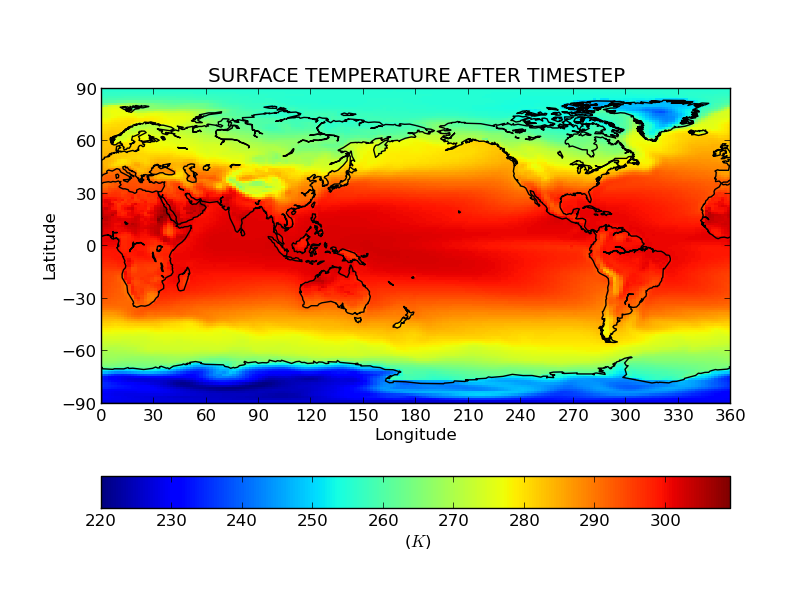
  
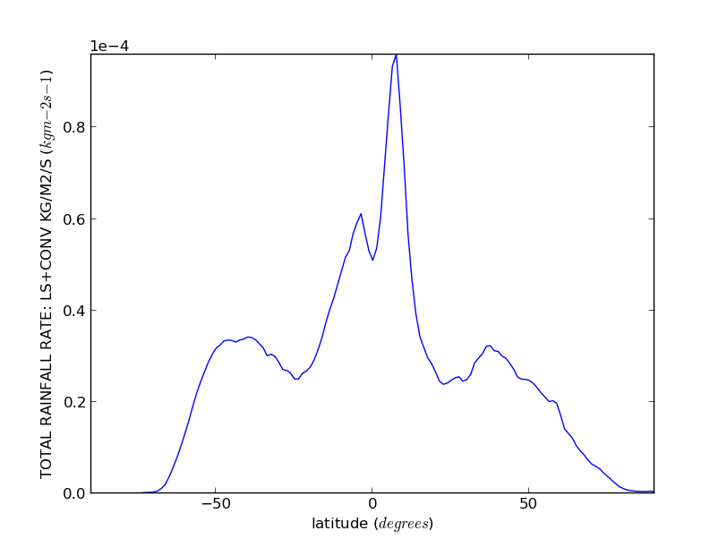
  
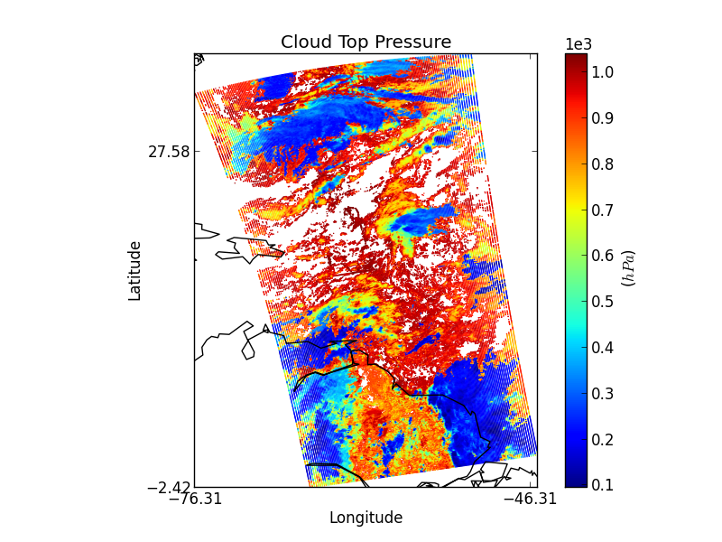
  
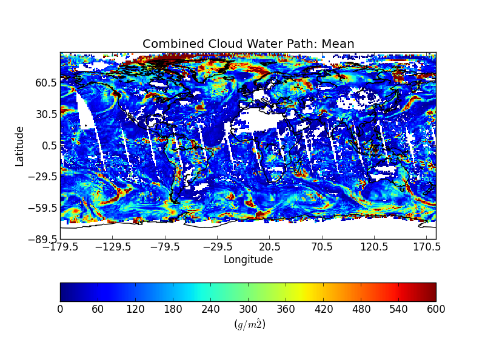
  
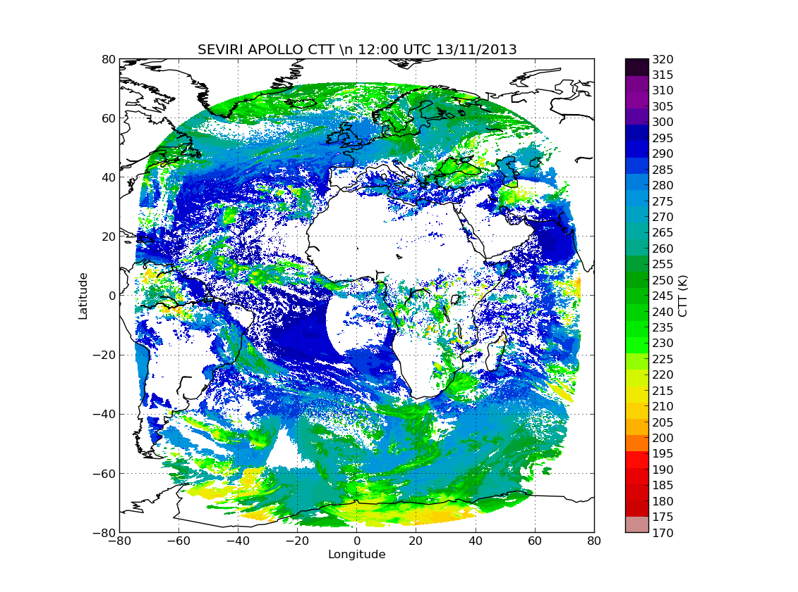
  
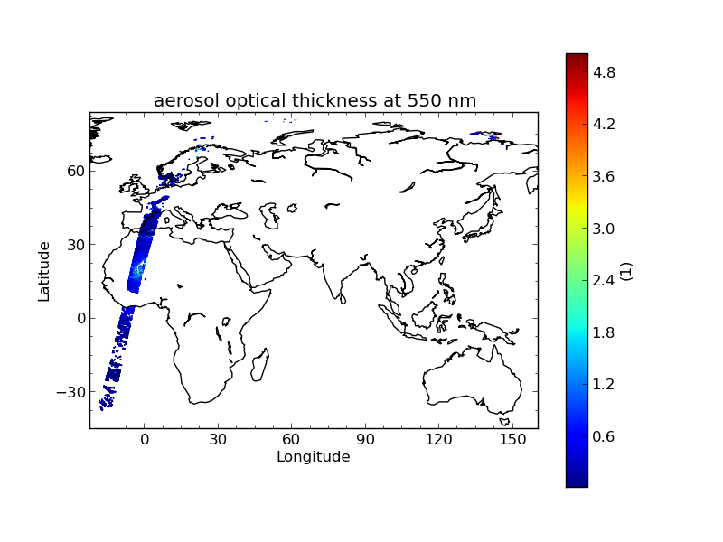
  
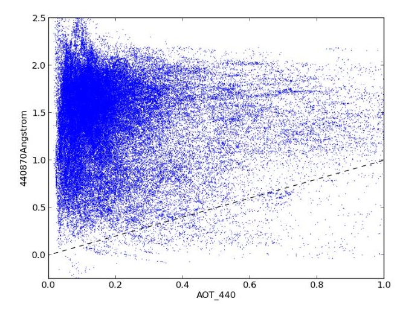
  
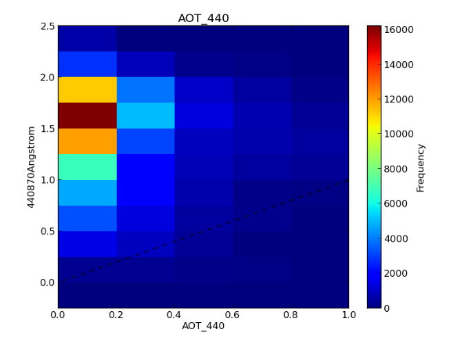
  
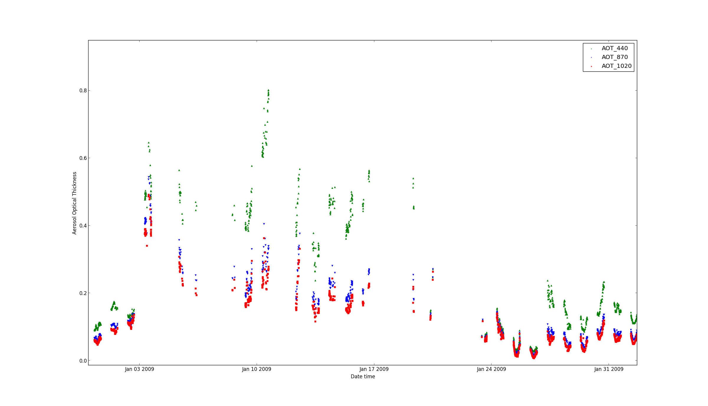
  
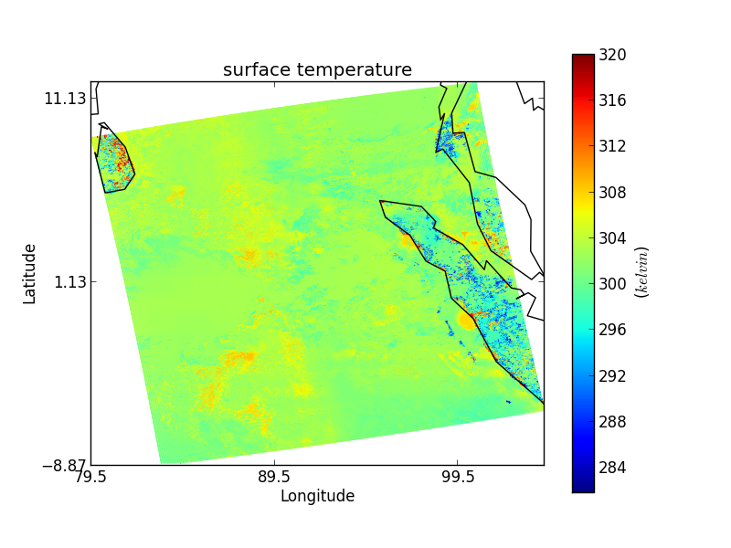
  
.. image:: img/cloudsat_RVOD.png
   :width: 400px
  
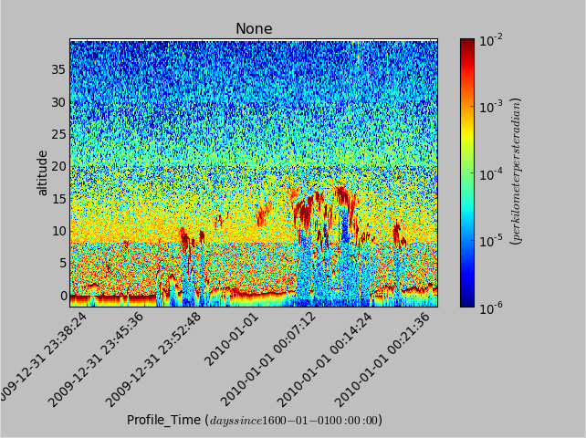
  
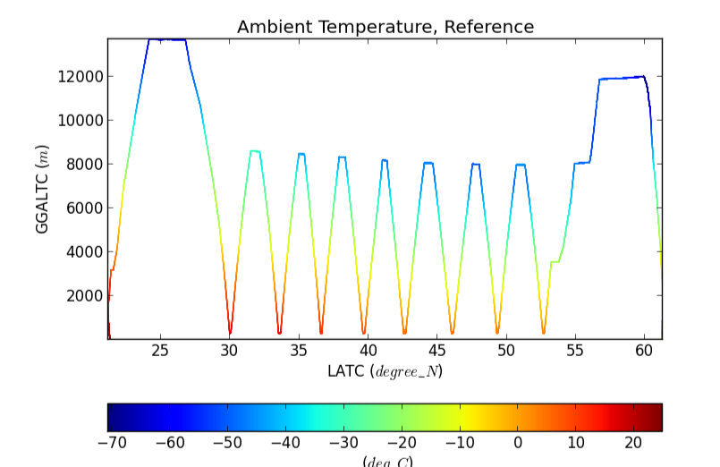