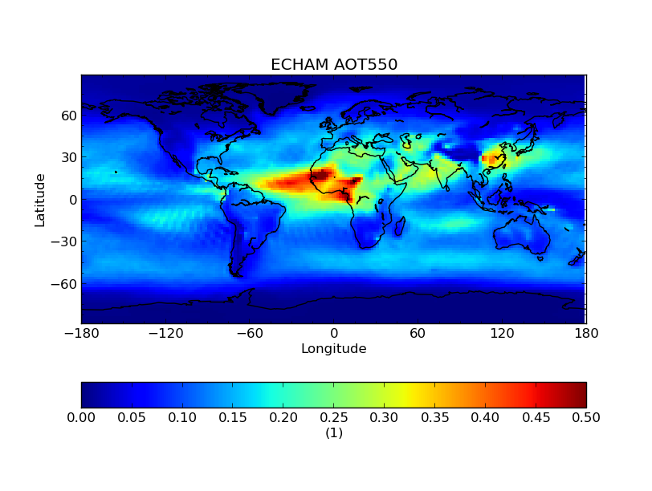
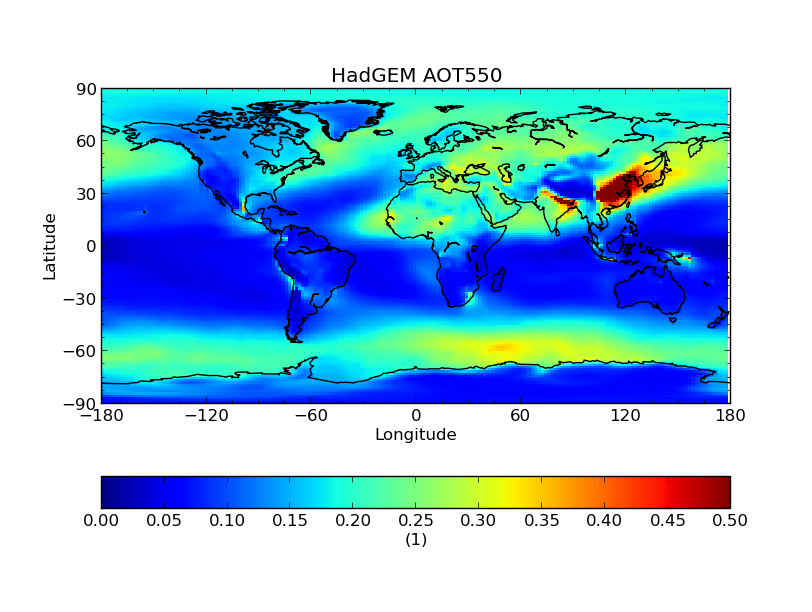
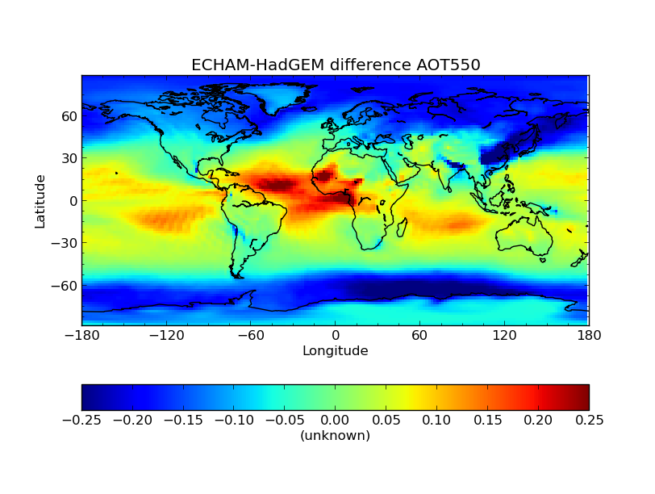
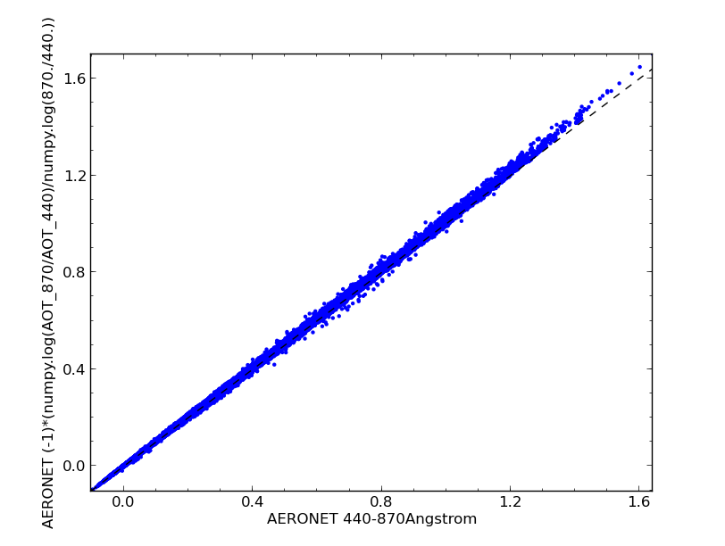
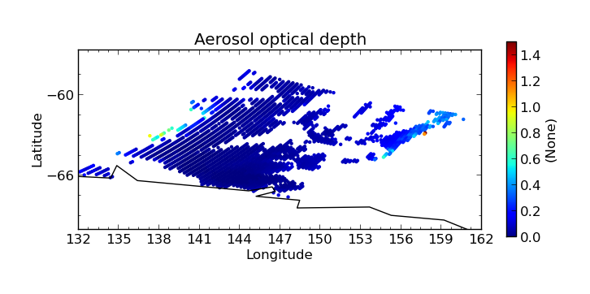
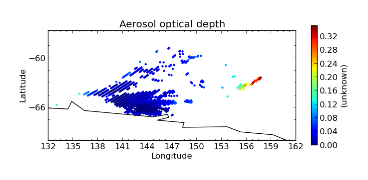
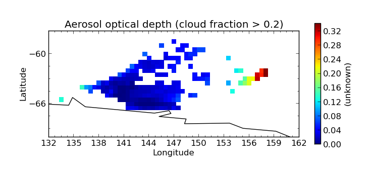

.. _evaluation:
.. |nbsp| unicode:: 0xA0

**********
Evaluation
**********

The Community Intercomparison Suite allows you to perform general arithmetic operations between different variables
using the 'eval' command. For example, you might want to interpolate a value between two variables.

.. note::
    All variables used in a evaluation **must** be of the same shape in order to be compatible, i.e. the same number of
    points in each dimension, and of the same type (Ungridded or Gridded). This means that, for example, operations
    between different data products are unlikely to work correctly - performing a colocation or aggregation onto a
    common grid would be a good pre-processing step.

.. _warning:

.. warning::
            This CIS command performs a Python `eval() <https://docs.python.org/2/library/functions.html#eval>`_ on
            user input. This has the potential to be a security risk and before deploying CIS to any environment where
            your user input is untrusted (e.g. if you want to run CIS as a web service) **you must** satisfy yourself
            that any security risks have been mitigated. CIS implements the following security restrictions on the
            expression which is evaluated:

            * The eval() operates in a restricted namespace that only has access to a select handful of builtins
              (see :ref:`expr <expr>` below) - so ``__import__``, for example, is unavailable.
            * The only module available in the namespace is `numpy <http://www.numpy.org/>`_.
            * Any expression containing two consecutive underscores (``__``) is assumed to be harmful and will not
              be evaluated.

The evaluate syntax looks like this::

    $ cis eval <datagroup>... <expr> <units> [-o [<output_var>:]<outputfile>] [--attributes <attributes>]

where square brackets denote optional commands and:

``<datagroup>``
  is a modified :ref:`CIS datagroup <datagroups>` of the format
  ``<variable>[=<alias>]...:<filename>[:product=<productname>]``. One or more
  datagroups should be given.

  * ``<variable>`` is a mandatory variable or list of variables to use.

  * ``<alias>`` is an optional alternative variable name to use in place of the name given in the file. As you will see
    in the :ref:`expression <expr>` section, the variable names given will need to be valid python variable names,
    which means:

      \1. |nbsp| They may use only the characters [A-Z], [a-z] and numbers [0-9] provided they do not start with a number

      \2. |nbsp| The only special character which may be used is the underscore (_) - but don't use two consecutively
      (see :ref:`security note <warning>`)

      \3. |nbsp| Don't use any of the `reserved python keywords
      <https://docs.python.org/2/reference/lexical_analysis.html#keywords>`_ such as ``class`` or ``and`` as variable
      names (they're OK if they're only part of a name though).

      \4. |nbsp| Avoid using names of `python builtins <https://docs.python.org/2/library/functions.html#built-in-funcs>`_
      like ``max`` or ``abs`` (again, it's OK if they're only part of a name).

    So if the variable name in your file violates these rules (e.g. *'550-870Angstrom'*) use an alias:

    ``550-870Angstrom=a550to870``

  * ``<filename>`` is a mandatory file or list of files to read from.

  * ``<productname>`` is an optional CIS data product to use (see :ref:`Data Products <data-products-reading>`):

  See :ref:`datagroups` for a more detailed explanation of datagroups.

.. _expr:

``<expr>``
  is the arithmetic expression to evaluate; for example: ``variable1+variable2``. Use the following basic
  rules to get started:

    \1. |nbsp| Use the variable names (or aliases) as given in the datagroups (they're case-sensitive) - don't enclose
    them in quotes.

    \2. |nbsp| If your expression contains whitespace, you'll need to enclose the whole expression in single or double
    quotes.

    \3. |nbsp| Construct your expression using plus ``+``, minus ``-``, times ``*``, divide ``/`` , power ``**``
    (note that you **can't** use ``^`` for exponents, like you typically can in spreadsheets and some other computer
    languages). Parentheses ``()`` can be used to group elements so that your expression is evaluated in the order
    you intend.

  If you need more functionality, you're encountering errors or not getting the answer you expect then you should
  consider the following.

    1\. |nbsp| This expression will be evaluated in Python using the `eval() method
    <https://docs.python.org/2/library/functions.html#eval>`_ (see :ref:`security note <warning>`), so the expression must be a valid Python
    expression.

    \2. |nbsp| The only Python methods available to you are a trimmed down list of the `python builtins
    <https://docs.python.org/2/library/functions.html#built-in-funcs>`_: `'abs', 'all', 'any', 'bool', 'cmp', 'divmod',
    'enumerate', 'filter', 'int', 'len', 'map', 'max', 'min', 'pow', 'range', 'reduce', 'reversed', 'round',
    'sorted', 'sum', 'xrange', 'zip'`.

    \3. |nbsp| The `numpy module <http://www.numpy.org/>`_ is available, so you can use any of its methods e.g.
    ``numpy.mean(variable1)``.

    \4. |nbsp| For security reasons, double underscores (``__``) must not appear anywhere in the expression.

    \5. |nbsp| The expression must produce an output array of the same shape as the input variables.

    \6. |nbsp| The expression is evaluated at the array level, not at the element level - so the variables in an
    expression represent numpy arrays, not individual numeric values. This means that ``numpy.mean([var1,var2])``
    will give you a combined average *over the whole of both arrays* (i.e. a single number, not an array), which
    would be invalid (consider the previous rule). However, you could add the mean (over the whole array) of one
    variable to every point on a second variable by doing ``var1 + numpy.mean(var2)``.

.. note::
    CIS eval command will flatten ungridded data so that structure present in the input files will be ignored. This
    allows you to compare ungridded data with different shapes, e.g. (3,5) and (15,)

``<units>``
  is a mandatory argument describing the units of the resulting expression. This should be a
  `CF compliant <http://cfconventions.org/Data/cf-conventions/cf-conventions-1.7/build/ch03.html#table-supported-units>`_
  units string, e.g. ``"kg m^-3"``. Where this contains spaces, the whole string should be enclosed in quotes.

``<outputfile>``
  is an optional argument specifying the file to output to. This will be automatically given a ``.nc`` extension if not
  present and if the output is ungridded, will be prepended with ``cis-`` to identify it as a CIS output file. This must
  not be the same file path as any of the input files. If not provided, the default output filename is *out.nc*

  * ``<output_var>`` is an optional prefix to the output file argument to specify the name of the output variable within
    the output file, e.g. ``-o my_new_var:output_filename.nc``. If not provided, the default output variable name is
    *calculated_variable*

``<attributes>``
  is an optional argument allowing users to provide additional metadata to be included in the evaluation output variable.
  This should be indicated by the attributes flag (``--attributes`` or ``-a``). The attributes should then follow in
  comma-separated, key=value pairs, for example ``--attributes standard_name=convective_rainfall_amount,echam_version=6.1.00``.
  Whitespace is permitted in both the names and the values, but then must be enclosed in quotes: ``-a "operating system = "AIX 6.1 Power6"``.
  Colons or equals signs may not be used in attribute names or values.

Evaluation Examples
===================

Comparison of annual Aerosol Optical Thickness from models
----------------------------------------------------------

In this example we compare annual Aerosol Optical Thickness from ECHAM and HadGEM model data. The data used in this
example can be found at ``/group_workspaces/jasmin/cis/data``.

First we produce annual averages of our data by :ref:`aggregating <aggregation>`::

    $ cis aggregate od550aer:ECHAM_fixed/2007_2D_3hr/od550aer.nc t -o echam-od550aer
    $ cis aggregate od550aer:HadGEM_fixed/test_fix/od550aer.nc t -o hadgem-od550aer

    $ cis plot od550aer:echam-od550aer.nc --xmin -180 --xmax 180 --cbarorient=horizontal --title="ECHAM AOT550" --vmin=0 --vmax=0.5
    $ cis plot od550aer:hadgem-od550aer.nc --xmin -180 --xmax 180 --cbarorient=horizontal --title="HadGEM AOT550" --vmin=0 --vmax=0.5

We then linearly interpolate the HadGEM data onto the ECHAM grid::

    $ cis col od550aer:hadgem-od550aer.nc echam-od550aer.nc:colocator=lin -o hadgem-od550aer-colocated

    $ cis plot od550aer:hadgem-od550aer-colocated.nc --xmin -180 --xmax 180 --cbarorient=horizontal --title="HadGEM AOT550" --vmin=0 --vmax=0.5

.. image:: img/eval/hadgem_colocated.png
   :width: 450px

Next we subtract the two fields using::

    $ cis eval od550aer=a:echam-od550aer.nc od550=b:hadgem-od550aer-collocated.nc "a-b" 1 -o modeldifference

Finally we plot the evaluated output::

    $ cis plot od550aer:modeldifference.nc --xmin -180 --xmax 180 --cbarorient=horizontal --title="ECHAM-HadGEM difference AOT550" --v min=-0.25 --vmax=0.2

Calculation of Angstrom exponent for AERONET data
-------------------------------------------------
AERONET data allows us to calculate Angstrom Exponent (AE) and then compare it against the AE already in the file.
They should strongly correlate although it is not expected they will be identical due to averaging etc during
production of AERONET datafiles.

The file agoufou.lev20 refers to ``/group_workspaces/jasmin/cis/data/aeronet/AOT/LEV20/ALL_POINTS/920801_121229_Agoufou.lev20``

The AE is calculated using an eval statement::

    $ cis eval AOT_440,AOT_870:agoufou.lev20 "(-1)* (numpy.log(AOT_870/AOT_440)/numpy.log(870./440.))" 1 -o alfa

Plotting it shows the expected correlation::

    $ cis plot 440-870Angstrom:agoufou.lev20 calculated_variable:cis-alfa.nc --type comparativescatter --itemwidth=10 --xlabel="AERONET 440-870Angstrom" --ylabel="AERONET (-1)*(numpy.log(AOT_870/AOT_440)/numpy.log(870./440.))"

This correlation can be confirmed by using the CIS :ref:`stats <statistics>` command::

    $ cis stats 440-870Angstrom:agoufou.lev20 calculated_variable:cis-alfa.nc

    ==================================
    RESULTS OF STATISTICAL COMPARISON:
    ==================================
    Number of points: 63126
    Mean value of dataset 1: 0.290989032142
    Mean value of dataset 2: 0.295878214327
    Standard deviation for dataset 1: 0.233995525021
    Standard deviation for dataset 2: 0.235381075635
    Mean of absolute difference: 0.00488918218519
    Standard deviation of absolute difference: 0.00546343157047
    Mean of relative difference: 0.0284040419499
    Standard deviation of relative difference: 3.95137224542
    Spearman's rank coefficient: 0.999750939223
    Linear regression gradient: 1.00566622549
    Linear regression intercept: 0.003240372714
    Linear regression r-value: 0.999746457079
    Linear regression standard error: 0.00530006646489

.. _evaluation-conditional:

Using Evaluation for Conditional Aggregation
--------------------------------------------

The `eval` command can be combined with other CIS commands to allow you to perform more complex tasks than would
otherwise be possible.

For example, you might want to aggregate a satellite measurement of one variable only when the corresponding cloud cover
fraction (stored in separate variable) is less than a certain value. The aggregate command doesn't allow this kind
of conditional aggregation on its own, but you can use an evaluation to achieve this in two stages.

In this example we use the MODIS file ``MOD04_L2.A2010001.2255.005.2010005215814.hdf`` in directory
``/group_workspaces/jasmin/cis/data/MODIS/MOD04_L2/``. The optical depth and cloud cover variables can be seen in the
following two plots::

    $ cis plot Optical_Depth_Land_And_Ocean:MOD04_L2.A2010001.2255.005.2010005215814.hdf --xmin 132 --xmax 162 --ymin -70 --title "Aerosol optical depth" --cbarscale 0.5 --itemwidth 10 -o cloud_fraction.png
    $ cis plot Cloud_Fraction_Ocean:MOD04_L2.A2010001.2255.005.2010005215814.hdf --xmin 132 --xmax 162 --ymin -70 --title "Cloud cover fraction" --cbarscale 0.5 --itemwidth 10 -o cloud_fraction.png

.. image:: img/eval/modis_cloud_fraction.png
   :width: 450px

First we perform an evaluation using the `numpy.masked_where <http://docs.scipy.org/doc/numpy/reference/generated/numpy.ma.masked_where.html#numpy.ma.masked_where>`_
method to produce an optical depth variable that is masked at all points where the cloud cover is more than 20%::

    $ cis eval Cloud_Fraction_Ocean=cloud,Optical_Depth_Land_And_Ocean=od:MOD04_L2.A2010001.2255.005.2010005215814.hdf "numpy.ma.masked_where(cloud > 0.2, od)" 1 -o od:masked_optical_depth.nc
    $ cis plot od:cis-masked_optical_depth.nc --xmin 132 --xmax 162 --ymin -70 --title Aerosol optical depth --cbarscale 0.5 --itemwidth 10 -o masked_optical_depth.png'

Then we perform an aggregation on this masked output file to give the end result - aerosol optical depth aggregated only
using points where the cloud cover is less than 20%::

    $ cis aggregate od:cis-masked_optical_depth.nc x=[132,162,0.5],y=[-70,-57,0.5] -o aggregated_masked_optical_depth
    $ cis plot od:aggregated_masked_optical_depth.nc --xmin 132 --xmax 162 --ymin -70 --title "Aerosol optical depth (cloud fraction > 0.2)" --cbarscale 0.5 -o aggregated_aod.png

