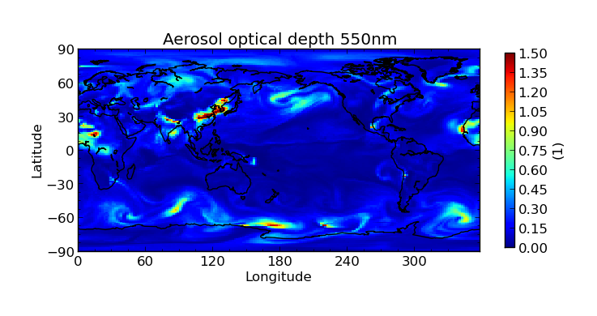
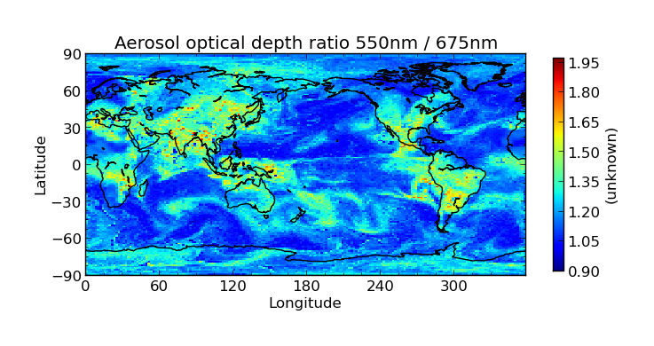

.. _evaluation:
.. |nbsp| unicode:: 0xA0

**********
Evaluation
**********

The Community Intercomparison Suite allows you to perform general arithmetic operations between different variables
using the 'eval' command. For example, you might want to interpolate a value between two variables.

.. note::
    All variables used in a evaluation **must** be of the same shape in order to be compatible, i.e. the same number of
    points in each dimension, and of the same type (Ungridded or Gridded). This means that, for example, operations
    between different data products are unlikely to work correctly - performing a colocation or aggregation onto a
    common grid would be a good pre-processing step.

.. _warning:

.. warning::
            This CIS command performs a Python `eval() <https://docs.python.org/2/library/functions.html#eval>`_ on
            user input. This has the potential to be a security risk and before deploying CIS to any environment where
            your user input is untrusted (e.g. if you want to run CIS as a web service) **you must** satisfy yourself
            that any security risks have been mitigated. CIS implements the following security restrictions on the
            expression which is evaluated:

            * The eval() operates in a restricted namespace that only has access to a select handful of builtins
              (see :ref:`expr <expr>` below) - so ``__import__``, for example, is unavailable.
            * The only module available in the namespace is `numpy <http://www.numpy.org/>`_.
            * Any expression containing two consecutive underscores (``__``) is assumed to be harmful and will not
              be evaluated.

The evaluate syntax looks like this::

    $ cis eval <datagroup>... <expr> [-o [<output_var>:]<outputfile>]

where square brackets denote optional commands and:

``<datagroup>``
  is of the format ``<variable>[=<alias>]...:<filename>[:product=<productname>]``. One or more
  datagroups should be given.

  * ``<variable>`` is a mandatory argument used to specify the name of the variable in the file to use. You may
    specify more than one variable to load, in which case you should separate them with commas.

  * ``<alias>`` is an optional alternative variable name to use in place of the name given in the file. As you will see
    in the :ref:`expression <expr>` section, the variable names given will need to be valid python variable names,
    which means:

      \1. |nbsp| They may use only the characters [A-Z], [a-z] and numbers [0-9] provided they do not start with a number

      \2. |nbsp| The only special character which may be used is the underscore (_) - but don't use two consecutively
      (see :ref:`security note <warning>`)

      \3. |nbsp| Don't use any of the `reserved python keywords
      <https://docs.python.org/2/reference/lexical_analysis.html#keywords>`_ such as ``class`` or ``and`` as variable
      names (they're OK if they're only part of a name though).

      \4. |nbsp| Avoid using names of `python builtins <https://docs.python.org/2/library/functions.html#built-in-funcs>`_
      like ``max`` or ``abs`` (again, it's OK if they're only part of a name).

      So if the variable name in your file violates these rules (e.g. *'550-870Angstrom'*) use an alias:

      ``550-870Angstrom=a550to870``

  * ``<filename>`` is a mandatory argument specifying the file to read the variable or variables from. You may specify
    multiple filenames separated using commas; each filename should be one of:

      \1. |nbsp| a single filename - this should be the full path to the file

      \2. |nbsp| a single directory - all files in this directory will be read

      \3. |nbsp| a wildcarded filename - A filename with any wildcards compatible with the python module glob, so that \*, ? and [] can all be used. E.g., ``/path/to/my/test*file_[0-9]``.

    Note that when multiple files are specified (whether through use of commas, pointing at a directory, or wildcarding),
    then all those files must contain all of the variables in that datagroup and the files should be 'compatible' - it
    should be possible to aggregate them together using a shared dimension (in a NetCDF file this is usually the unlimited
    dimension). So selecting multiple monthly files for a model run would be OK, but selecting files from two different
    datatypes would not be OK.

  * ``<productname>`` is an optional argument used to specify the type of files being read. If omitted, the program will
    attempt to figure out which product to use based on the filename. See :ref:`data-products-reading` to see a list of
    available products and their file signatures.

.. _expr:

``<expr>``
  is the arithmetic expression to evaluate; for example: ``variable1+variable2``. Use the following basic
  rules to get started:

    \1. |nbsp| Use the variable names (or aliases) as given in the datagroups (they're case-sensitive) - don't enclose
    them in quotes.

    \2. |nbsp| If your expression contains whitespace, you'll need to enclose the whole expression in single or double
    quotes.

    \3. |nbsp| Construct your expression using plus ``+``, minus ``-``, times ``*``, divide ``/`` , power ``**``
    (note that you **can't** use ``^`` for exponents, like you typically can in spreadsheets and some other computer
    languages). Parentheses ``()`` can be used to group elements so that your expression is evaluated in the order
    you intend.

  If you need more functionality, you're encountering errors or not getting the answer you expect then you should
  consider the following.

    1\. |nbsp| This expression will be evaluated in Python using the `eval() method
    <https://docs.python.org/2/library/functions.html#eval>`_ (see :ref:`security note <warning>`), so the expression must be a valid Python
    expression.

    \2. |nbsp| The only Python methods available to you are a trimmed down list of the `python builtins
    <https://docs.python.org/2/library/functions.html#built-in-funcs>`_: `'abs', 'all', 'any', 'bool', 'cmp', 'divmod',
    'enumerate', 'filter', 'int', 'len', 'map', 'max', 'min', 'pow', 'range', 'reduce', 'reversed', 'round',
    'sorted', 'sum', 'xrange', 'zip'`.

    \3. |nbsp| The `numpy module <http://www.numpy.org/>`_ is available, so you can use any of its methods e.g.
    ``numpy.mean(variable1)``.

    \4. |nbsp| For security reasons, double underscores (``__``) must not appear anywhere in the expression.

    \5. |nbsp| The expression must produce an output array of the same shape as the input variables.

    \6. |nbsp| The expression is evaluated at the array level, not at the element level - so the variables in an
    expression represent numpy arrays, not individual numeric values. This means that ``numpy.mean([var1,var2])``
    will give you a combined average *over the whole of both arrays* (i.e. a single number, not an array), which
    would be invalid (consider the previous rule). However, you could add the mean (over the whole array) of one
    variable to every point on a second variable by doing ``var1 + numpy.mean(var2)``.

``<outputfile>``
  is an optional argument specifying the file to output to. This will be automatically given a ``.nc`` extension if not
  present and if the output is ungridded, will be prepended with ``cis-`` to identify it as a CIS output file. This must
  not be the same file path as any of the input files. If not provided, the default output filename is *out.nc*

  * ``<output_var>`` is an optional prefix to the output file argument to specify the name of the output variable within
    the output file, e.g. ``-o my_new_var:output_filename.nc``. If not provided, the default output variable name is
    *calculated_variable*

Evaluation Example
==================

In this example, we calculate the ratio of aerosol optical depth at two wavelengths. The data we are using is
shown in the following CIS plot commands and can be found at ``/group_workspaces/jasmin/cis/data``::

    $ cis plot od550aer:HadGEM/2007_2D_3hr/od550aer.nc --title "Aerosol optical depth 550nm" --cbarscale 0.5 --vmin 0.0 --vmax 1.5
    $ cis plot od675aer:HadGEM/2007_2D_3hr/od675aer.nc --title "Aerosol optical depth 675nm" --cbarscale 0.5 --vmin 0.0 --vmax 1.5

.. note::

    In this example the files have been given the same name as the variable that is contained inside that file - e.g.
    variable ``od550aer`` is inside file ``od550aer.nc``. This doesn't always have to be the case; ``od550aer`` and
    ``od550aer.nc`` are two different things.

The following command is used to perform the evaluation::

    $ cis eval od550aer:HadGEM/2007_2D_3hr/od550aer.nc od675aer:HadGEM/2007_2D_3hr/od675aer.nc "od550aer/od675aer" -o aerosol_ratio:eval_out.nc

Which, when plotted gives the following result::

    $ cis plot aerosol_ratio:eval_out.nc --title "Aerosol optical dept ratio 550nm / 675nm" --cbarscale 0.5

