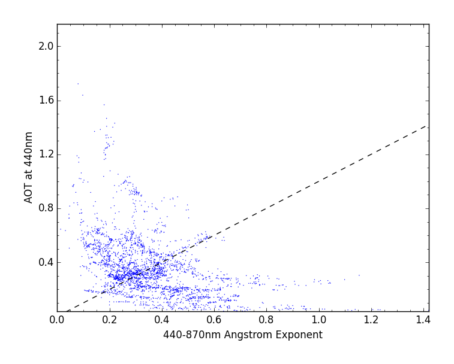
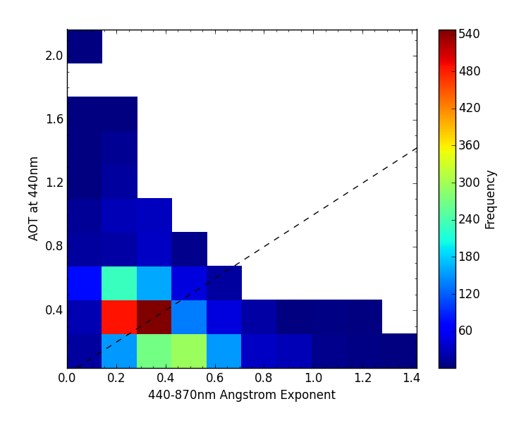

=======
Gallery
=======

.. figure:: img/model.png
   :width: 400px

   Model output data
  
.. figure:: img/line.png
   :width: 400px

   Aggregated model data

   % cis plot precip:xenida_zonal.nc --itemwidth=2 --xaxis latitude --xlabel "Latitude (degrees)" --yaxis precip --ylabel "Precipitation (\$kg/m^2/s\$)" --title "Zonal mean of total precipitation rate" -o line.png

.. figure:: img/MODIS_L2.png
   :width: 400px

   MODIS Level 2
  
.. figure:: img/MODIS_L3.png
   :width: 400px

   MODIS Level 3
  
.. figure:: img/seviri-ctt.png
   :width: 400px

   Seviri Cloud top temperature

.. figure:: img/agoufou_18022013_all_three.gif
   :width: 400px

   Aeronet time series

   Aeronet comparative scatter

   % cis plot 440-870Angstrom:../cis_repo_test_files/920801_091128_Agoufou_small.lev20 AOT_440:../cis_repo_test_files/920801_091128_Agoufou_small.lev20 --xlabel "440-870nm Angstrom Exponent" --ylabel "AOT at 440nm" --title "" --type comparativescatter -o comparative_scatter_Aeronet.png
  

   Aeronet comparatice histogram

   % cis plot 440-870Angstrom:920801_091128_Agoufou_small.lev20 AOT_440:../cis_repo_test_files/920801_091128_Agoufou_small.lev20 --xlabel "440-870nm Angstrom Exponent" --ylabel "AOT at 440nm" --title "" --type histogram3d -o comparativehistogram3d

.. figure:: img/aerosol_cci.png
   :width: 400px

   Aerosol CCI

.. figure:: img/cloudcci.png
   :width: 400px

   Cloud CCI

   %cis plot cwp:20080620072500-ESACCI-L2_CLOUD-CLD_PRODUCTS-MODIS-AQUA-fv1.0.nc
   -o Cloud_CCI --xmin 75 --xmax 110  --xstep 5

.. figure:: img/cloudsat_RVOD.png
   :width: 400px

   CloudSat Liquid water content
  
.. figure:: img/caliop_l1b.png
   :width: 400px

   CALIOP Level 1b
  
.. figure:: img/aircraft.png
   :width: 400px

   NCAR-RAF ambient temperature

   % cis plot ATX:RF04.20090114.192600_035100.PNI.nc --xaxis latitude --xlabel
   "Latitude (degrees north)" --yaxis altitude --ylabel "Altitude (\$m\$)" --cbarlabel "\$^{\circ}C\$" -o aircraft.png