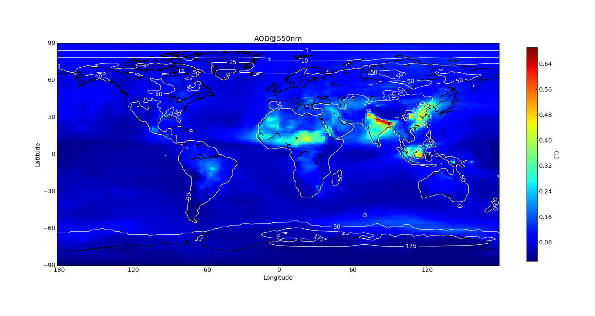
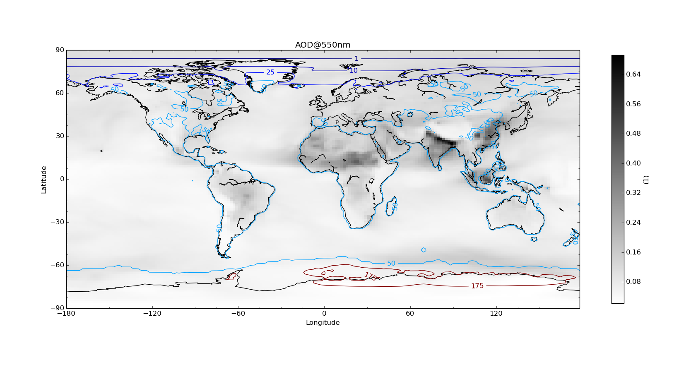
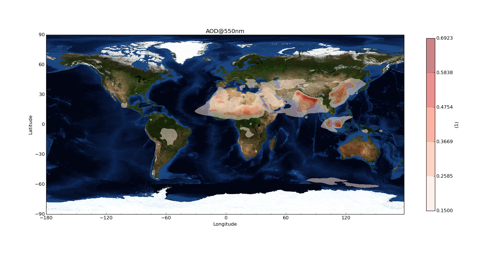
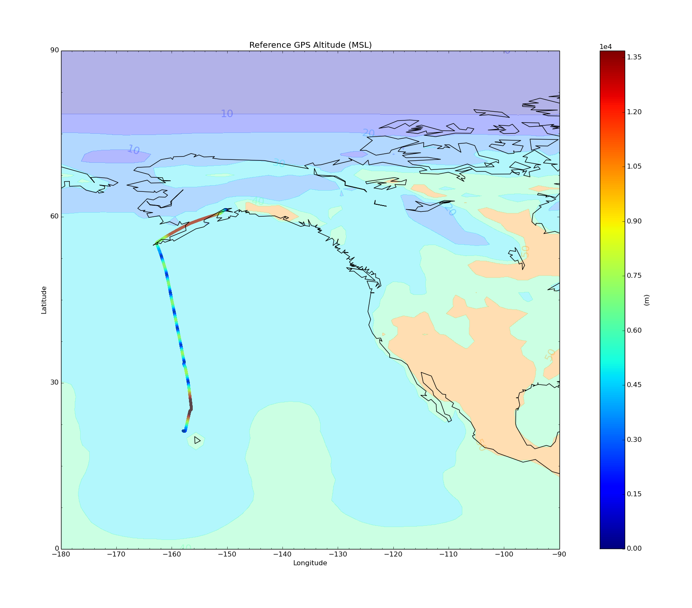
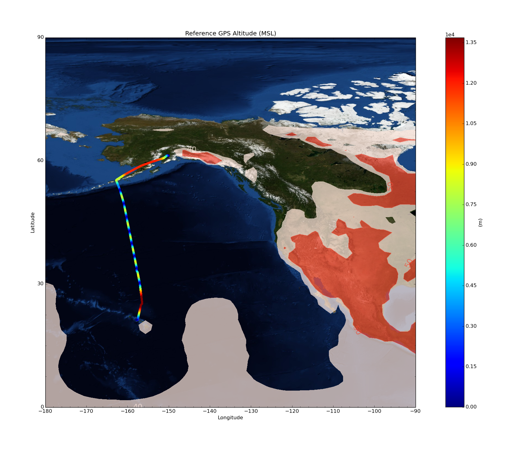

=====================
Overlay Plot Examples
=====================

First subset some gridded data that will be used for the examples::

  cis subset od550aer:aerocom.HadGEM3-A-GLOMAP.A2.CTRL.monthly.od550aer.2006.nc:NetCDFGriddedByVariableName t=[2006-10-13] -o HadGEM_od550aer-subset

  cis subset rsutcs:aerocom.HadGEM3-A-GLOMAP.A2.CTRL.monthly.rsutcs.2006.nc:NetCDFGriddedByVariableName t=[2006-10-13] -o HadGEM_rsutcs-subset

Contour over heatmap
====================

::

  cis plot od550aer:cis-HadGEM_od550aer-subset.nc:product=NetCDFGriddedByVariableName,type=heatmap rsutcs:cis-HadGEM_rsutcs-subset.nc:product=NetCDFGriddedByVariableName,type=contour,color=white,contlevels=[1,10,25,50,175] --type overlay --plotwidth 20 --plotheight 15 --cbarscale 0.5 -o overlay1.png

::

  cis plot od550aer:cis-HadGEM_od550aer-subset.nc:product=NetCDFGriddedByVariableName,type=heatmap,cmap=binary rsutcs:cis-HadGEM_rsutcs-subset.nc:product=NetCDFGriddedByVariableName,type=contour,cmap=jet,contlevels=[1,10,25,50,175] --type overlay --plotwidth 20 --plotheight 15 --cbarscale 0.5 -o overlay2.png

Filled contour with transparency on NASA Blue Marble
====================================================

::

  cis plot od550aer:cis-HadGEM_od550aer-subset.nc:product=NetCDFGriddedByVariableName,cmap=Reds,type=contourf,transparency=0.5,cmin=0.15 --type overlay --plotwidth 20 --plotheight 15 --cbarscale 0.5 --nasabluemarble

Scatter plus Filled Contour
===========================

::

  cis subset rsutcs:cis-HadGEM_rsutcs-subset.nc:NetCDFGriddedByVariableName x=[-180,-90],y=[0,90] -o HadGEM_rsutcs-subset2

  cis plot GGALT:RF04.20090114.192600_035100.PNI.nc:type=scatter rsutcs:cis-HadGEM_rsutcs-subset2.nc:product=NetCDFGriddedByVariableName,type=contourf,contlevels=[0,10,20,30,40,50,100],transparency=0.3,contlabel=true,contfontsize=18 --type overlay --plotwidth 20 --plotheight 15 --xaxis longitude --yaxis latitude --xmin -180 --xmax -90 --ymin 0 --ymax 90 --itemwidth 20 -o overlay4.png

::

  cis plot GGALT:RF04.20090114.192600_035100.PNI.nc:type=scatter rsutcs:cis-HadGEM_rsutcs-subset2.nc:product=NetCDFGriddedByVariableName,type=contourf,contlevels=[40,50,100],transparency=0.7,contlabel=true,contfontsize=18,cmap=Reds --type overlay --plotwidth 20 --plotheight 15 --xaxis longitude --yaxis latitude --xmin -180 --xmax -90 --ymin 0 --ymax 90 --itemwidth 20 --nasabluemarble -o overlay5.png

File Locations
==============

The gridded data files can be found at::

  /group_workspaces/jasmin/cis/AeroCom/A2/HadGEM3-A-GLOMAP.A2.CTRL/renamed

and the ungridded::

  /group_workspaces/jasmin/cis/jasmin_cis_repo_test_files

