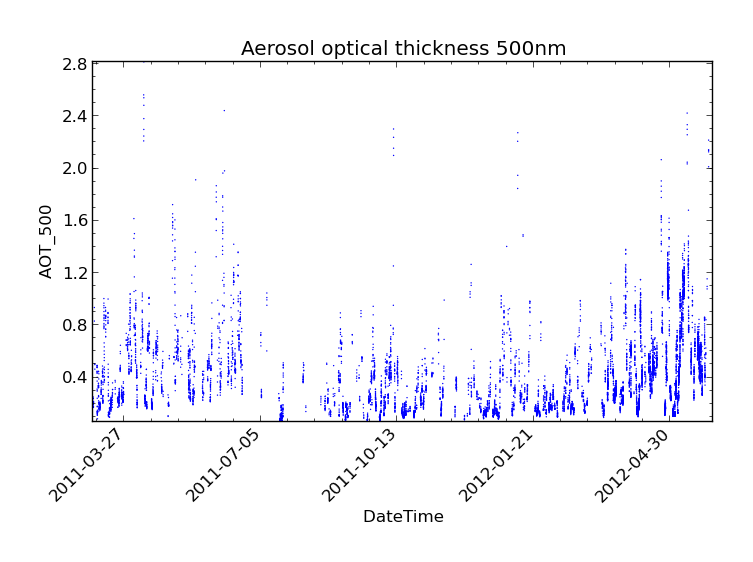
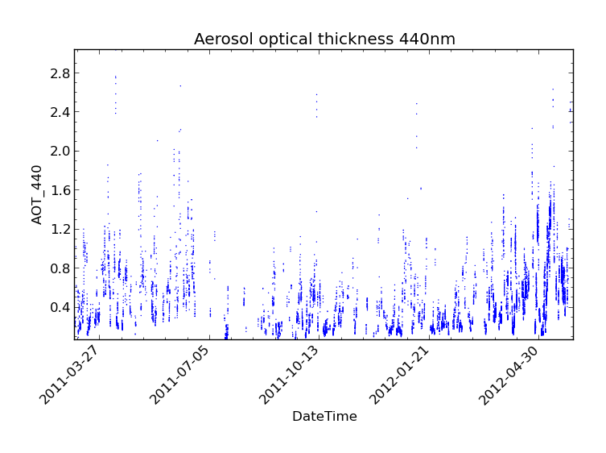

.. _statistics:
.. |nbsp| unicode:: 0xA0

**********
Statistics
**********

The Community Intercomparison Suite allows you to perform statistical analysis on two variables using the 'stats'
command. For example, you might wish to examine the correlation between a model data variable and actual measurements.
The 'stats' command will calculate:

#. Number of data points used in the analysis.
#. The mean and standard deviation of each dataset (separately).
#. The mean and standard deviation of the absolute difference (var2 - var1).
#. The mean and standard deviation of the relative difference ((var2 - var1) / var1).
#. The Linear Pearson correlation coefficient.
#. The Spearman Rank correlation coefficient.
#. The coefficients of linear regression (i.e. var2 = a var1 + b ), r-value, and standard error of the estimate.

These values will be displayed on screen and can optionally be save as NetCDF output.

.. note::
    Both variables used in a statistical analysis **must** be of the same shape in order to be compatible, i.e. the
    same number of points in each dimension, and of the same type (ungridded or gridded). This means that, for example,
    operations between different data products are unlikely to work correctly - performing a colocation or aggregation
    onto a common grid would be a good pre-processing step.

.. note::
    Only points which have non-missing values for both variables will be included in the analysis. The number of points
    this includes is part of the output of the stats command.

The statistics syntax looks like this::

    $ cis stats <datagroup>... [-o <outputfile>]

where:

``<datagroup>``
  is of the format ``<variable>...:<filename>[:product=<productname>]``. One or more
  datagroups should be given, but the total number of variables declared in all datagroups must be exactly two.

  * ``<variable>`` is a mandatory argument used to specify the name of the variable in the file to use. You may
    specify more than one variable to load, in which case you should separate them with commas.

  * ``<filename>`` is a mandatory argument specifying the file to read the variable or variables from. You may specify
    multiple filenames separated using commas; each filename should be one of:

      \1. |nbsp| a single filename - this should be the full path to the file

      \2. |nbsp| a single directory - all files in this directory will be read

      \3. |nbsp| a wildcarded filename - A filename with any wildcards compatible with the python module glob, so that \*, ? and [] can all be used. E.g., ``/path/to/my/test*file_[0-9]``.

    Note that when multiple files are specified (whether through use of commas, pointing at a directory, or wildcarding),
    then all those files must contain all of the variables in that datagroup and the files should be 'compatible' - it
    should be possible to aggregate them together using a shared dimension (in a NetCDF file this is usually the unlimited
    dimension). So selecting multiple monthly files for a model run would be OK, but selecting files from two different
    datatypes would not be OK.

  * ``<productname>`` is an optional argument used to specify the type of files being read. If omitted, the program will
    attempt to figure out which product to use based on the filename. See :ref:`data-products-reading` to see a list of
    available products and their file signatures.

``<outputfile>``
  is an optional argument specifying a file to output to. This will be automatically given a ``.nc`` extension if not
  present. This must not be the same file path as any of the input files. If not provided, then the output will not be
  saved to a file and will only be displayed on screen.

Statistics Example
==================

In this example, we perform a statistical comparison of Aeronet aerosol optical thickness at two wavelengths.
The data we are using is shown in the following CIS plot commands
and can be found at ``/group_workspaces/jasmin/cis/data``::

    $ cis plot AOT_500:aeronet/AOT/LEV20/ALL_POINTS/920801_121229_Yonsei_University.lev20 --title "Aerosol optical thickness 550nm"
    $ cis plot AOT_440:aeronet/AOT/LEV20/ALL_POINTS/920801_121229_Yonsei_University.lev20 --title "Aerosol optical thickness 440nm"

We then perform a statistical comparison of these variables using::

    $ cis stats AOT_500,AOT_440:aeronet/AOT/LEV20/ALL_POINTS/920801_121229_Yonsei_University.lev20

Which gives the following output::

    ===================================================================
    RESULTS OF STATISTICAL COMPARISON:
    -------------------------------------------------------------------
    Compared all points which have non-missing values in both variables
    ===================================================================
    Number of points: 10727
    Mean value of dataset 1: 0.427751965508
    Mean value of dataset 2: 0.501316673814
    Standard deviation for dataset 1: 0.307680514916
    Standard deviation for dataset 2: 0.346274598431
    Mean of absolute difference: 0.0735647083061
    Standard deviation of absolute difference: 0.0455684788406
    Mean of relative difference: 0.188097066086
    Standard deviation of relative difference: 0.0528621773819
    Spearman's rank coefficient: 0.998289763952
    Linear regression gradient: 1.12233533743
    Linear regression intercept: 0.0212355272705
    Linear regression r-value: 0.997245296339
    Linear regression standard error: 0.0256834603945
